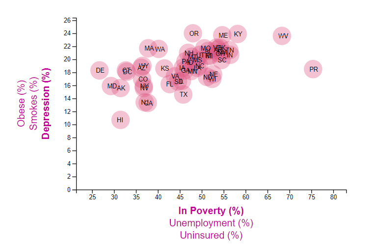

## Data Journalism
### 2014 By State
#### Observation: In Poverty (%) versus Suffers from Depression (%)

The poverty level and the risk of depression are positively correlated. (0.575)  Those with income below the poverty level have a greater risk of suffering from depression. Overall the risk of depression is fairly distributed  between 10% - 25%, with the higher percentage risk of depression in states with a higher poverty percentage. 

#### X-axis Options:
* **In Poverty (%):** represents the percentage of families and people whose income in the past 12 months is below the povert level.  Families include families with female householder, no husband present, with related children under 18 years, with related children under 5 years only.
* **Unemployment (%):** represents the percentage of the population that are 16 years and over and unemployed.
* **Uninsured (%):** represents the percentage of the civilian noninstitutionalized population that have no health insurance coverage.

#### Y-axis Options:
* **Suffers from Depression (%)**
* **Smokes (%)**
* **Is Obese (%)**

