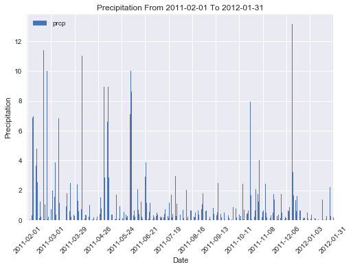
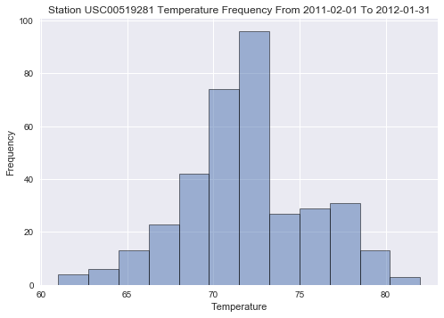
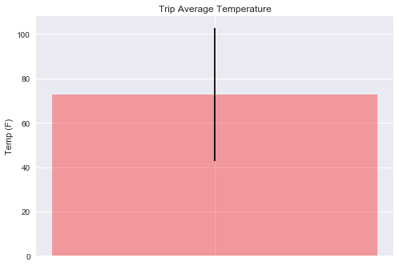

## Angela Shane


### Data Engineering

* Uses Pandas to read in the measurement and station CSV files as DataFrames.
* Inspects the data for NaNs and missing values and replaces them with 0 values.
* Saves the cleaned CSV files with the prefix clean_.


### Database Engineering

* Uses Pandas to read the cleaned measurements and stations CSV data.
* Uses the SQLAlchemy engine and connection string to create a database called hawaii.sqlite.
* Uses the declarative_base and creates ORM classes for each table.
* Creates the tables in the database using create_all.


### Climate Analysis


```python
import datetime as dt
import numpy as np
import pandas as pd
import matplotlib.pyplot as plt
import matplotlib.ticker as mtick
import seaborn as sns

import sqlalchemy
from sqlalchemy.ext.automap import automap_base
from sqlalchemy.orm import Session
from sqlalchemy import create_engine,inspect, func
```


```python
# Database Setup
engine = create_engine("sqlite:///hawaii.sqlite")
```


```python
# Declare a Base using `automap_base()`
Base = automap_base()
```


```python
# Use the Base class to reflect the database tables
Base.prepare(engine, reflect=True)
```


```python
# Print all of the classes mapped to the Base
Base.classes.keys()
```


    ['measurements', 'stations']


```python
# Assign the measurements class to a variable called `Measurements`
# Assign the stations class to a variable called `Stations`
Measurements = Base.classes.measurements
Stations = Base.classes.stations
```


```python
# Create a session
session = Session(engine)
```


```python
# Get a list of column names and types
inspector = inspect(engine)
columns = inspector.get_columns('measurements')
for c in columns:
    print(c['name'], c["type"])
```

    id INTEGER
    station TEXT
    date TEXT
    prcp FLOAT
    tobs INTEGER
    


```python
df = pd.DataFrame(session.query(Measurements.station, Measurements.date, Measurements.prcp, Measurements.tobs).all())
df.head()
```


<div>
<table border="1" class="dataframe">
  <thead>
    <tr style="text-align: right;">
      <th></th>
      <th>station</th>
      <th>date</th>
      <th>prcp</th>
      <th>tobs</th>
    </tr>
  </thead>
  <tbody>
    <tr>
      <th>0</th>
      <td>USC00519397</td>
      <td>2010-01-01</td>
      <td>0.08</td>
      <td>65</td>
    </tr>
    <tr>
      <th>1</th>
      <td>USC00519397</td>
      <td>2010-01-02</td>
      <td>0.00</td>
      <td>63</td>
    </tr>
    <tr>
      <th>2</th>
      <td>USC00519397</td>
      <td>2010-01-03</td>
      <td>0.00</td>
      <td>74</td>
    </tr>
    <tr>
      <th>3</th>
      <td>USC00519397</td>
      <td>2010-01-04</td>
      <td>0.00</td>
      <td>76</td>
    </tr>
    <tr>
      <th>4</th>
      <td>USC00519397</td>
      <td>2010-01-06</td>
      <td>NaN</td>
      <td>73</td>
    </tr>
  </tbody>
</table>
</div>


## Precipitation Analysis
* Design a query to retrieve the last 12 months of precipitation data.
* Select only the date and prcp values.
* Load the query results into a Pandas DataFrame and set the index to the date column.
* Plot the results using the DataFrame plot method.


```python
prcp = df[(df.date >= '2011-02-01') & (df.date <= '2012-01-31')].groupby(['date']).sum()
prcp.sort_index()
prcp.head()
```


<div>
<table border="1" class="dataframe">
  <thead>
    <tr style="text-align: right;">
      <th></th>
      <th>prcp</th>
      <th>tobs</th>
    </tr>
    <tr>
      <th>date</th>
      <th></th>
      <th></th>
    </tr>
  </thead>
  <tbody>
    <tr>
      <th>2011-02-01</th>
      <td>0.25</td>
      <td>599</td>
    </tr>
    <tr>
      <th>2011-02-02</th>
      <td>0.01</td>
      <td>612</td>
    </tr>
    <tr>
      <th>2011-02-03</th>
      <td>0.00</td>
      <td>610</td>
    </tr>
    <tr>
      <th>2011-02-04</th>
      <td>0.02</td>
      <td>576</td>
    </tr>
    <tr>
      <th>2011-02-05</th>
      <td>0.00</td>
      <td>399</td>
    </tr>
  </tbody>
</table>
</div>


```python
x_axis = np.arange(len(prcp.prcp))
x_lbls = [value for idx, value in enumerate(prcp.index) if idx % 28 == 0]
```


```python
plt.bar(x_axis,prcp.prcp)
tick_locations = [value + 0.1 for idx, value in enumerate(x_axis) if idx % 28 == 0]
plt.xticks(tick_locations, x_lbls, rotation=45)
plt.title("Precipitation From " + prcp.index[0] + " To " + prcp.index[-1])
plt.xlabel("Date")
plt.ylabel("Precipitation")
sns.set()
plt.savefig('precipitation.png')
plt.show()
```





## Station Analysis

* Design a query to calculate the total number of stations.
* Design a query to find the most active stations.
* List the stations and observation counts in descending order
* Which station has the highest number of observations?
* Design a query to retrieve the last 12 months of temperature observation data (tobs).
* Filter by the station with the highest number of observations.
* Plot the results as a histogram with bins=12.


```python
stations = df.station.unique()
num_stations = len(stations)
```


```python
# stations and observation counts in descending order
df.groupby('station')['date'].count().sort_values(ascending=False)
```


    station
    USC00519281    2772
    USC00519397    2724
    USC00513117    2709
    USC00519523    2669
    USC00516128    2612
    USC00514830    2202
    USC00511918    1979
    USC00517948    1372
    USC00518838     511
    Name: date, dtype: int64


### Observation: Station USC00519281 has the highest number of observations with 2772 observations


```python
max_station = 'USC00519281'
station = df[(df.station == max_station) & (df.date >= '2011-02-01') & (df.date <= '2012-01-31') ].groupby(['date']).sum()
station.sort_index()
station.head()
```


<div>
<table border="1" class="dataframe">
  <thead>
    <tr style="text-align: right;">
      <th></th>
      <th>prcp</th>
      <th>tobs</th>
    </tr>
    <tr>
      <th>date</th>
      <th></th>
      <th></th>
    </tr>
  </thead>
  <tbody>
    <tr>
      <th>2011-02-01</th>
      <td>0.0</td>
      <td>62</td>
    </tr>
    <tr>
      <th>2011-02-02</th>
      <td>0.0</td>
      <td>67</td>
    </tr>
    <tr>
      <th>2011-02-03</th>
      <td>0.0</td>
      <td>68</td>
    </tr>
    <tr>
      <th>2011-02-04</th>
      <td>0.0</td>
      <td>62</td>
    </tr>
    <tr>
      <th>2011-02-05</th>
      <td>0.0</td>
      <td>65</td>
    </tr>
  </tbody>
</table>
</div>


```python
plt.hist(station.tobs, bins=12, alpha=0.5, edgecolor='black', linewidth='1')
plt.title("Station " + max_station + " Temperature Frequency From " + station.index[0] + " To " + station.index[-1])
plt.xlabel("Temperature")
plt.ylabel("Frequency")
sns.set()
plt.savefig('temperature.png')
plt.show()
```





## Temperature Analysis
* Write a function called calc_temps that will accept a start date and end date in the format %Y-%m-%d and return the minimum, average, and maximum temperatures for that range of dates.
* Use the calc_temps function to calculate the min, avg, and max temperatures for your trip using the matching dates from the previous year (i.e. use "2017-01-01" if your trip start date was "2018-01-01")
* Plot the min, avg, and max temperature from your previous query as a bar chart.
* Use the average temperature as the bar height.
* Use the peak-to-peak (tmax-tmin) value as the y error bar (yerr).


```python
def calc_temps(start_date, end_date):
    temps = df[(df.date >= start_date) & (df.date <= end_date)]
    min_temp = temps.tobs.min()
    max_temp = temps.tobs.max()
    mean_temp = temps.tobs.mean()
    return (min_temp, max_temp, mean_temp)
```


```python
tmin, tmax, tmean = calc_temps('2011-02-01', '2012-01-31')
tmin, tmax, tmean
```


    (56, 86, 72.80798827409308)


```python
x = ['']
energy = [tmean]
variance = [tmax-tmin]
x_pos = [i for i, _ in enumerate(x)]

plt.bar(x_pos, energy, color='red', alpha=.35, yerr=variance)
plt.ylabel("Temp (F)")
plt.title("Trip Average Temperature")

plt.xticks(x_pos, x)
sns.set()
plt.show()
plt.savefig('average_trip_temperature.png')
```





```python

```
