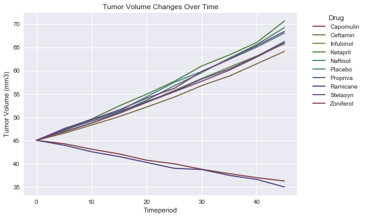
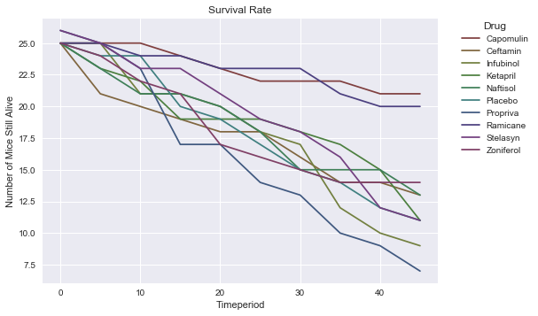

### Student: Angela Shane
#### Homework 05: Pharma

### Observations:
1. The drugs Ramicane and Capomulin have the best descrease in tumor size
2. The drugs Ramicane and Capomulin have the best survival rates
3. All drugs have an increase in number of metastic sites over time


```python
import pandas as pd
from random import randint
import matplotlib.pyplot as plt
import numpy as np
import seaborn as sns
```

#### Read data into dataframes


```python
ctrial_f = "./raw_data/clinicaltrial_data.csv"
ctrial_df = pd.read_csv(ctrial_f)
ctrial_df.head()
#len(ctrial_df) #1893
#len(ctrial_df["Mouse ID"].unique()) #249
```


<div>
<table border="1" class="dataframe">
  <thead>
    <tr style="text-align: right;">
      <th></th>
      <th>Mouse ID</th>
      <th>Timepoint</th>
      <th>Tumor Volume (mm3)</th>
      <th>Metastatic Sites</th>
    </tr>
  </thead>
  <tbody>
    <tr>
      <th>0</th>
      <td>b128</td>
      <td>0</td>
      <td>45.0</td>
      <td>0</td>
    </tr>
    <tr>
      <th>1</th>
      <td>f932</td>
      <td>0</td>
      <td>45.0</td>
      <td>0</td>
    </tr>
    <tr>
      <th>2</th>
      <td>g107</td>
      <td>0</td>
      <td>45.0</td>
      <td>0</td>
    </tr>
    <tr>
      <th>3</th>
      <td>a457</td>
      <td>0</td>
      <td>45.0</td>
      <td>0</td>
    </tr>
    <tr>
      <th>4</th>
      <td>c819</td>
      <td>0</td>
      <td>45.0</td>
      <td>0</td>
    </tr>
  </tbody>
</table>
</div>


```python
mdrug_f = "./raw_data/mouse_drug_data.csv"
mdrug_df = pd.read_csv(mdrug_f)
mdrug_df.head()
#len(mdrug_df) #250
#len(mdrug_df["Mouse ID"].unique()) #249
```


<div>
<table border="1" class="dataframe">
  <thead>
    <tr style="text-align: right;">
      <th></th>
      <th>Mouse ID</th>
      <th>Drug</th>
    </tr>
  </thead>
  <tbody>
    <tr>
      <th>0</th>
      <td>f234</td>
      <td>Stelasyn</td>
    </tr>
    <tr>
      <th>1</th>
      <td>x402</td>
      <td>Stelasyn</td>
    </tr>
    <tr>
      <th>2</th>
      <td>a492</td>
      <td>Stelasyn</td>
    </tr>
    <tr>
      <th>3</th>
      <td>w540</td>
      <td>Stelasyn</td>
    </tr>
    <tr>
      <th>4</th>
      <td>v764</td>
      <td>Stelasyn</td>
    </tr>
  </tbody>
</table>
</div>


#### Merge dataframes


```python
results = pd.merge(ctrial_df, mdrug_df,how="left",on="Mouse ID")
#len(results) #1906 - duplicate mouseID on two drugs
results.head()
```


<div>
<table border="1" class="dataframe">
  <thead>
    <tr style="text-align: right;">
      <th></th>
      <th>Mouse ID</th>
      <th>Timepoint</th>
      <th>Tumor Volume (mm3)</th>
      <th>Metastatic Sites</th>
      <th>Drug</th>
    </tr>
  </thead>
  <tbody>
    <tr>
      <th>0</th>
      <td>b128</td>
      <td>0</td>
      <td>45.0</td>
      <td>0</td>
      <td>Capomulin</td>
    </tr>
    <tr>
      <th>1</th>
      <td>f932</td>
      <td>0</td>
      <td>45.0</td>
      <td>0</td>
      <td>Ketapril</td>
    </tr>
    <tr>
      <th>2</th>
      <td>g107</td>
      <td>0</td>
      <td>45.0</td>
      <td>0</td>
      <td>Ketapril</td>
    </tr>
    <tr>
      <th>3</th>
      <td>a457</td>
      <td>0</td>
      <td>45.0</td>
      <td>0</td>
      <td>Ketapril</td>
    </tr>
    <tr>
      <th>4</th>
      <td>c819</td>
      <td>0</td>
      <td>45.0</td>
      <td>0</td>
      <td>Ketapril</td>
    </tr>
  </tbody>
</table>
</div>


```python
summary = pd.DataFrame(results.groupby(["Drug","Timepoint"]).agg({"Tumor Volume (mm3)":"mean", "Metastatic Sites":"sum", "Mouse ID":"count" }))
summary.reset_index(inplace=True)
summary.head()
```


<div>
<table border="1" class="dataframe">
  <thead>
    <tr style="text-align: right;">
      <th></th>
      <th>Drug</th>
      <th>Timepoint</th>
      <th>Tumor Volume (mm3)</th>
      <th>Metastatic Sites</th>
      <th>Mouse ID</th>
    </tr>
  </thead>
  <tbody>
    <tr>
      <th>0</th>
      <td>Capomulin</td>
      <td>0</td>
      <td>45.000000</td>
      <td>0</td>
      <td>25</td>
    </tr>
    <tr>
      <th>1</th>
      <td>Capomulin</td>
      <td>5</td>
      <td>44.266086</td>
      <td>4</td>
      <td>25</td>
    </tr>
    <tr>
      <th>2</th>
      <td>Capomulin</td>
      <td>10</td>
      <td>43.084291</td>
      <td>8</td>
      <td>25</td>
    </tr>
    <tr>
      <th>3</th>
      <td>Capomulin</td>
      <td>15</td>
      <td>42.064317</td>
      <td>9</td>
      <td>24</td>
    </tr>
    <tr>
      <th>4</th>
      <td>Capomulin</td>
      <td>20</td>
      <td>40.716325</td>
      <td>15</td>
      <td>23</td>
    </tr>
  </tbody>
</table>
</div>


```python
num_drugs = len(summary["Drug"].unique())
num_drugs
```


    10


#### Pivot dataframe based on timepoint


```python
summary_drug = summary.pivot(columns='Drug', index="Timepoint")
summary_drug.head()
```


<div>
<table border="1" class="dataframe">
  <thead>
    <tr>
      <th></th>
      <th colspan="10" halign="left">Tumor Volume (mm3)</th>
      <th>...</th>
      <th colspan="10" halign="left">Mouse ID</th>
    </tr>
    <tr>
      <th>Drug</th>
      <th>Capomulin</th>
      <th>Ceftamin</th>
      <th>Infubinol</th>
      <th>Ketapril</th>
      <th>Naftisol</th>
      <th>Placebo</th>
      <th>Propriva</th>
      <th>Ramicane</th>
      <th>Stelasyn</th>
      <th>Zoniferol</th>
      <th>...</th>
      <th>Capomulin</th>
      <th>Ceftamin</th>
      <th>Infubinol</th>
      <th>Ketapril</th>
      <th>Naftisol</th>
      <th>Placebo</th>
      <th>Propriva</th>
      <th>Ramicane</th>
      <th>Stelasyn</th>
      <th>Zoniferol</th>
    </tr>
    <tr>
      <th>Timepoint</th>
      <th></th>
      <th></th>
      <th></th>
      <th></th>
      <th></th>
      <th></th>
      <th></th>
      <th></th>
      <th></th>
      <th></th>
      <th></th>
      <th></th>
      <th></th>
      <th></th>
      <th></th>
      <th></th>
      <th></th>
      <th></th>
      <th></th>
      <th></th>
      <th></th>
    </tr>
  </thead>
  <tbody>
    <tr>
      <th>0</th>
      <td>45.000000</td>
      <td>45.000000</td>
      <td>45.000000</td>
      <td>45.000000</td>
      <td>45.000000</td>
      <td>45.000000</td>
      <td>45.000000</td>
      <td>45.000000</td>
      <td>45.000000</td>
      <td>45.000000</td>
      <td>...</td>
      <td>25</td>
      <td>25</td>
      <td>25</td>
      <td>25</td>
      <td>25</td>
      <td>25</td>
      <td>26</td>
      <td>25</td>
      <td>26</td>
      <td>25</td>
    </tr>
    <tr>
      <th>5</th>
      <td>44.266086</td>
      <td>46.503051</td>
      <td>47.062001</td>
      <td>47.389175</td>
      <td>46.796098</td>
      <td>47.125589</td>
      <td>47.248967</td>
      <td>43.944859</td>
      <td>47.527452</td>
      <td>46.851818</td>
      <td>...</td>
      <td>25</td>
      <td>21</td>
      <td>25</td>
      <td>23</td>
      <td>23</td>
      <td>24</td>
      <td>25</td>
      <td>25</td>
      <td>25</td>
      <td>24</td>
    </tr>
    <tr>
      <th>10</th>
      <td>43.084291</td>
      <td>48.285125</td>
      <td>49.403909</td>
      <td>49.582269</td>
      <td>48.694210</td>
      <td>49.423329</td>
      <td>49.101541</td>
      <td>42.531957</td>
      <td>49.463844</td>
      <td>48.689881</td>
      <td>...</td>
      <td>25</td>
      <td>20</td>
      <td>21</td>
      <td>22</td>
      <td>21</td>
      <td>24</td>
      <td>23</td>
      <td>24</td>
      <td>23</td>
      <td>22</td>
    </tr>
    <tr>
      <th>15</th>
      <td>42.064317</td>
      <td>50.094055</td>
      <td>51.296397</td>
      <td>52.399974</td>
      <td>50.933018</td>
      <td>51.359742</td>
      <td>51.067318</td>
      <td>41.495061</td>
      <td>51.529409</td>
      <td>50.779059</td>
      <td>...</td>
      <td>24</td>
      <td>19</td>
      <td>21</td>
      <td>19</td>
      <td>21</td>
      <td>20</td>
      <td>17</td>
      <td>24</td>
      <td>23</td>
      <td>21</td>
    </tr>
    <tr>
      <th>20</th>
      <td>40.716325</td>
      <td>52.157049</td>
      <td>53.197691</td>
      <td>54.920935</td>
      <td>53.644087</td>
      <td>54.364417</td>
      <td>53.346737</td>
      <td>40.238325</td>
      <td>54.067395</td>
      <td>53.170334</td>
      <td>...</td>
      <td>23</td>
      <td>18</td>
      <td>20</td>
      <td>19</td>
      <td>20</td>
      <td>19</td>
      <td>17</td>
      <td>23</td>
      <td>21</td>
      <td>17</td>
    </tr>
  </tbody>
</table>
<p>5 rows × 30 columns</p>
</div>


```python
xaxis = summary_drug.index #timepoint
```


```python
# tumor volume changes over time for each treatment.
tumor = summary_drug["Tumor Volume (mm3)"]
tumor.head()
```


<div>
<table border="1" class="dataframe">
  <thead>
    <tr style="text-align: right;">
      <th>Drug</th>
      <th>Capomulin</th>
      <th>Ceftamin</th>
      <th>Infubinol</th>
      <th>Ketapril</th>
      <th>Naftisol</th>
      <th>Placebo</th>
      <th>Propriva</th>
      <th>Ramicane</th>
      <th>Stelasyn</th>
      <th>Zoniferol</th>
    </tr>
    <tr>
      <th>Timepoint</th>
      <th></th>
      <th></th>
      <th></th>
      <th></th>
      <th></th>
      <th></th>
      <th></th>
      <th></th>
      <th></th>
      <th></th>
    </tr>
  </thead>
  <tbody>
    <tr>
      <th>0</th>
      <td>45.000000</td>
      <td>45.000000</td>
      <td>45.000000</td>
      <td>45.000000</td>
      <td>45.000000</td>
      <td>45.000000</td>
      <td>45.000000</td>
      <td>45.000000</td>
      <td>45.000000</td>
      <td>45.000000</td>
    </tr>
    <tr>
      <th>5</th>
      <td>44.266086</td>
      <td>46.503051</td>
      <td>47.062001</td>
      <td>47.389175</td>
      <td>46.796098</td>
      <td>47.125589</td>
      <td>47.248967</td>
      <td>43.944859</td>
      <td>47.527452</td>
      <td>46.851818</td>
    </tr>
    <tr>
      <th>10</th>
      <td>43.084291</td>
      <td>48.285125</td>
      <td>49.403909</td>
      <td>49.582269</td>
      <td>48.694210</td>
      <td>49.423329</td>
      <td>49.101541</td>
      <td>42.531957</td>
      <td>49.463844</td>
      <td>48.689881</td>
    </tr>
    <tr>
      <th>15</th>
      <td>42.064317</td>
      <td>50.094055</td>
      <td>51.296397</td>
      <td>52.399974</td>
      <td>50.933018</td>
      <td>51.359742</td>
      <td>51.067318</td>
      <td>41.495061</td>
      <td>51.529409</td>
      <td>50.779059</td>
    </tr>
    <tr>
      <th>20</th>
      <td>40.716325</td>
      <td>52.157049</td>
      <td>53.197691</td>
      <td>54.920935</td>
      <td>53.644087</td>
      <td>54.364417</td>
      <td>53.346737</td>
      <td>40.238325</td>
      <td>54.067395</td>
      <td>53.170334</td>
    </tr>
  </tbody>
</table>
</div>


#### Generate random colors


```python
import colorsys

HSV_tuples = [(x*1.0/num_drugs, 0.5, 0.5) for x in range(num_drugs)]
colors = list(map(lambda x: colorsys.hsv_to_rgb(*x), HSV_tuples))
colors
```


    [(0.5, 0.25, 0.25),
     (0.5, 0.4, 0.25),
     (0.44999999999999996, 0.5, 0.25),
     (0.30000000000000004, 0.5, 0.25),
     (0.25, 0.5, 0.3500000000000001),
     (0.25, 0.5, 0.5),
     (0.25, 0.3500000000000001, 0.5),
     (0.2999999999999998, 0.25, 0.5),
     (0.4500000000000002, 0.25, 0.5),
     (0.5, 0.25, 0.3999999999999999)]


#### Creating a scatter plot that shows how the tumor volume changes over time for each treatment.


```python
# https://stackoverflow.com/questions/19189488/use-a-loop-to-plot-n-charts-python

for i in range(num_drugs):
    plt.plot(xaxis, tumor.iloc[:,i],color=colors[i])

plt.legend(title='Drug', bbox_to_anchor=(1.05, 1), loc=2, borderaxespad=0.)
plt.ylabel('Tumor Volume (mm3)')
plt.xlabel('Timeperiod')
plt.title('Tumor Volume Changes Over Time')
sns.set()
plt.savefig('tumor_change.png')
plt.show()
```





#### Creating a scatter plot that shows how the number of metastatic (cancer spreading) sites changes over time for each treatment.


```python
# number of metastatic (cancer spreading) sites changes over time for each treatment.
metastatic = summary_drug["Metastatic Sites"]
#metastatic.head()

for i in range(num_drugs):
    plt.plot(xaxis, metastatic.iloc[:,i],color=colors[i])

plt.legend(title='Drug', bbox_to_anchor=(1.05, 1), loc=2, borderaxespad=0.)
plt.ylabel('Number of Metastatic Sites')
plt.xlabel('Timeperiod')
plt.title('Number of Metastic Sites Changes Over Time')
sns.set()
plt.savefig('number_metastic_sites.png')
plt.show()
```


#### Creating a scatter plot that shows the number of mice still alive through the course of treatment (Survival Rate)


```python
#Creating a scatter plot that shows the number of mice still alive through the course of treatment (Survival Rate)

survival_rate = summary_drug["Mouse ID"]
survival_rate.head()

for i in range(num_drugs):
    plt.plot(xaxis, survival_rate.iloc[:,i],color=colors[i])

plt.legend(title='Drug', bbox_to_anchor=(1.05, 1), loc=2, borderaxespad=0.)
plt.ylabel('Number of Mice Still Alive')
plt.xlabel('Timeperiod')
plt.title('Survival Rate')
sns.set()
plt.savefig('survival_rate.png')
plt.show()
```





#### Creating a bar graph that compares the total % tumor volume change for each drug across the full 45 days.


```python
def get_change(current, previous):
    if current == previous:
        return 100.0
    try:
       return (abs(current - previous)/previous)*100.0
    except ZeroDivisionError:
        return 0
```


```python
summary_drug["Tumor Volume (mm3)"]
```


<div>
<table border="1" class="dataframe">
  <thead>
    <tr style="text-align: right;">
      <th>Drug</th>
      <th>Capomulin</th>
      <th>Ceftamin</th>
      <th>Infubinol</th>
      <th>Ketapril</th>
      <th>Naftisol</th>
      <th>Placebo</th>
      <th>Propriva</th>
      <th>Ramicane</th>
      <th>Stelasyn</th>
      <th>Zoniferol</th>
    </tr>
    <tr>
      <th>Timepoint</th>
      <th></th>
      <th></th>
      <th></th>
      <th></th>
      <th></th>
      <th></th>
      <th></th>
      <th></th>
      <th></th>
      <th></th>
    </tr>
  </thead>
  <tbody>
    <tr>
      <th>0</th>
      <td>45.000000</td>
      <td>45.000000</td>
      <td>45.000000</td>
      <td>45.000000</td>
      <td>45.000000</td>
      <td>45.000000</td>
      <td>45.000000</td>
      <td>45.000000</td>
      <td>45.000000</td>
      <td>45.000000</td>
    </tr>
    <tr>
      <th>5</th>
      <td>44.266086</td>
      <td>46.503051</td>
      <td>47.062001</td>
      <td>47.389175</td>
      <td>46.796098</td>
      <td>47.125589</td>
      <td>47.248967</td>
      <td>43.944859</td>
      <td>47.527452</td>
      <td>46.851818</td>
    </tr>
    <tr>
      <th>10</th>
      <td>43.084291</td>
      <td>48.285125</td>
      <td>49.403909</td>
      <td>49.582269</td>
      <td>48.694210</td>
      <td>49.423329</td>
      <td>49.101541</td>
      <td>42.531957</td>
      <td>49.463844</td>
      <td>48.689881</td>
    </tr>
    <tr>
      <th>15</th>
      <td>42.064317</td>
      <td>50.094055</td>
      <td>51.296397</td>
      <td>52.399974</td>
      <td>50.933018</td>
      <td>51.359742</td>
      <td>51.067318</td>
      <td>41.495061</td>
      <td>51.529409</td>
      <td>50.779059</td>
    </tr>
    <tr>
      <th>20</th>
      <td>40.716325</td>
      <td>52.157049</td>
      <td>53.197691</td>
      <td>54.920935</td>
      <td>53.644087</td>
      <td>54.364417</td>
      <td>53.346737</td>
      <td>40.238325</td>
      <td>54.067395</td>
      <td>53.170334</td>
    </tr>
    <tr>
      <th>25</th>
      <td>39.939528</td>
      <td>54.287674</td>
      <td>55.715252</td>
      <td>57.678982</td>
      <td>56.731968</td>
      <td>57.482574</td>
      <td>55.504138</td>
      <td>38.974300</td>
      <td>56.166123</td>
      <td>55.432935</td>
    </tr>
    <tr>
      <th>30</th>
      <td>38.769339</td>
      <td>56.769517</td>
      <td>58.299397</td>
      <td>60.994507</td>
      <td>59.559509</td>
      <td>59.809063</td>
      <td>58.196374</td>
      <td>38.703137</td>
      <td>59.826738</td>
      <td>57.713531</td>
    </tr>
    <tr>
      <th>35</th>
      <td>37.816839</td>
      <td>58.827548</td>
      <td>60.742461</td>
      <td>63.371686</td>
      <td>62.685087</td>
      <td>62.420615</td>
      <td>60.350199</td>
      <td>37.451996</td>
      <td>62.440699</td>
      <td>60.089372</td>
    </tr>
    <tr>
      <th>40</th>
      <td>36.958001</td>
      <td>61.467895</td>
      <td>63.162824</td>
      <td>66.068580</td>
      <td>65.600754</td>
      <td>65.052675</td>
      <td>63.045537</td>
      <td>36.574081</td>
      <td>65.356386</td>
      <td>62.916692</td>
    </tr>
    <tr>
      <th>45</th>
      <td>36.236114</td>
      <td>64.132421</td>
      <td>65.755562</td>
      <td>70.662958</td>
      <td>69.265506</td>
      <td>68.084082</td>
      <td>66.258529</td>
      <td>34.955595</td>
      <td>68.438310</td>
      <td>65.960888</td>
    </tr>
  </tbody>
</table>
</div>


```python
tumor_volume = summary_drug["Tumor Volume (mm3)"].iloc[[0,-1]].transpose()
tumor_volume.columns=['first','last']
tumor_volume
```


<div>
<table border="1" class="dataframe">
  <thead>
    <tr style="text-align: right;">
      <th></th>
      <th>first</th>
      <th>last</th>
    </tr>
    <tr>
      <th>Drug</th>
      <th></th>
      <th></th>
    </tr>
  </thead>
  <tbody>
    <tr>
      <th>Capomulin</th>
      <td>45.0</td>
      <td>36.236114</td>
    </tr>
    <tr>
      <th>Ceftamin</th>
      <td>45.0</td>
      <td>64.132421</td>
    </tr>
    <tr>
      <th>Infubinol</th>
      <td>45.0</td>
      <td>65.755562</td>
    </tr>
    <tr>
      <th>Ketapril</th>
      <td>45.0</td>
      <td>70.662958</td>
    </tr>
    <tr>
      <th>Naftisol</th>
      <td>45.0</td>
      <td>69.265506</td>
    </tr>
    <tr>
      <th>Placebo</th>
      <td>45.0</td>
      <td>68.084082</td>
    </tr>
    <tr>
      <th>Propriva</th>
      <td>45.0</td>
      <td>66.258529</td>
    </tr>
    <tr>
      <th>Ramicane</th>
      <td>45.0</td>
      <td>34.955595</td>
    </tr>
    <tr>
      <th>Stelasyn</th>
      <td>45.0</td>
      <td>68.438310</td>
    </tr>
    <tr>
      <th>Zoniferol</th>
      <td>45.0</td>
      <td>65.960888</td>
    </tr>
  </tbody>
</table>
</div>


```python
tumor_volume['pct_chg'] =tumor_volume.apply(lambda row: get_change(row['last'], row['first']),axis=1)
tumor_volume
```


<div>
<table border="1" class="dataframe">
  <thead>
    <tr style="text-align: right;">
      <th></th>
      <th>first</th>
      <th>last</th>
      <th>pct_chg</th>
    </tr>
    <tr>
      <th>Drug</th>
      <th></th>
      <th></th>
      <th></th>
    </tr>
  </thead>
  <tbody>
    <tr>
      <th>Capomulin</th>
      <td>45.0</td>
      <td>36.236114</td>
      <td>19.475303</td>
    </tr>
    <tr>
      <th>Ceftamin</th>
      <td>45.0</td>
      <td>64.132421</td>
      <td>42.516492</td>
    </tr>
    <tr>
      <th>Infubinol</th>
      <td>45.0</td>
      <td>65.755562</td>
      <td>46.123472</td>
    </tr>
    <tr>
      <th>Ketapril</th>
      <td>45.0</td>
      <td>70.662958</td>
      <td>57.028795</td>
    </tr>
    <tr>
      <th>Naftisol</th>
      <td>45.0</td>
      <td>69.265506</td>
      <td>53.923347</td>
    </tr>
    <tr>
      <th>Placebo</th>
      <td>45.0</td>
      <td>68.084082</td>
      <td>51.297960</td>
    </tr>
    <tr>
      <th>Propriva</th>
      <td>45.0</td>
      <td>66.258529</td>
      <td>47.241175</td>
    </tr>
    <tr>
      <th>Ramicane</th>
      <td>45.0</td>
      <td>34.955595</td>
      <td>22.320900</td>
    </tr>
    <tr>
      <th>Stelasyn</th>
      <td>45.0</td>
      <td>68.438310</td>
      <td>52.085134</td>
    </tr>
    <tr>
      <th>Zoniferol</th>
      <td>45.0</td>
      <td>65.960888</td>
      <td>46.579751</td>
    </tr>
  </tbody>
</table>
</div>


```python
x_axis = np.arange(len(tumor_volume))
x_lbls = tumor_volume.index
```


```python
plt.bar(x_axis,tumor_volume['pct_chg'])
tick_locations = [value + 0.1 for value in x_axis]
plt.xticks(tick_locations, x_lbls, rotation=90)
plt.title("Percent Tumor Volume Change over 45 days")
plt.xlabel("Drug")
plt.ylabel("Tumor Volume % Change")
sns.set()
plt.savefig('pct_tumor_vol_chg.png')
plt.show()
```


```python

```
