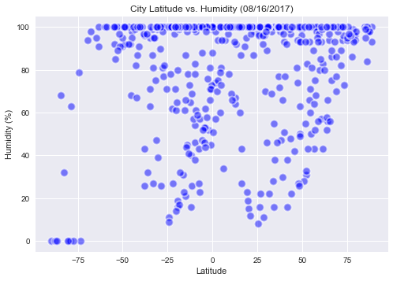

```python
#!pip install citipy
```

### Student: Angela Shane
#### Homework 06: WeatherPy

#### Analysis
"What's the weather like as we approach the equator?"

* Observation 1: The temperature peaks as you get closer to the equator (latitude = 0).
* Observation 2: The temperature does not drop below 0 until you get to a latitude of -60 to -90.
* Observation 3: There doesn't seem to be much of a correlation between th equator and the humidity, cloudiness or wind speed.


```python
import json
import requests
import pandas as pd
from citipy import citipy
from random import uniform
import matplotlib.pyplot as plt
import seaborn as sns
from datetime import datetime
```


```python
cities_df = pd.DataFrame(columns=("city","country","lat","lng","temp","humidity","cloudiness","wind_speed"))
```


```python
def getCoordinates(quadrant):
    if quadrant == 1:
        x = uniform(0,90)
        y = uniform(0,-180)
        return x,y
    if quadrant == 2:
        x = uniform(0,90)
        y = uniform(0,180)
        return x,y
    if quadrant == 3:
        x = uniform(0,-90)
        y = uniform(0,180)
        return x,y
    x = uniform(0,-90)
    y = uniform(0,-180)
    return x,y
```

#### Generate Random Cities
* to generate a full range of cities, generate longitude and latitude based on quadrant
* check for duplicate cities


```python
sample_size_lim = 500
sample_size = len(cities_df)
while sample_size < sample_size_lim:
    quadrant = (sample_size % 4) + 1
    point = (getCoordinates(quadrant))
    city = citipy.nearest_city(point[0], point[1])
    if not ((cities_df['city'] == city.city_name) & (cities_df['country'] == city.country_code)).any():
        #print(f"city: {city.city_name} country: {city.country_code}, coordinates: {point}")
        cities_df.loc[sample_size] = [city.city_name, city.country_code, point[0], point[1],'','','','']
    sample_size = len(cities_df)
cities_df.head(10)
```


<div>
<table border="1" class="dataframe">
  <thead>
    <tr style="text-align: right;">
      <th></th>
      <th>city</th>
      <th>country</th>
      <th>lat</th>
      <th>lng</th>
      <th>temp</th>
      <th>humidity</th>
      <th>cloudiness</th>
      <th>wind_speed</th>
    </tr>
  </thead>
  <tbody>
    <tr>
      <th>0</th>
      <td>ilulissat</td>
      <td>gl</td>
      <td>70.986942</td>
      <td>-45.947934</td>
      <td></td>
      <td></td>
      <td></td>
      <td></td>
    </tr>
    <tr>
      <th>1</th>
      <td>butaritari</td>
      <td>ki</td>
      <td>9.207698</td>
      <td>167.481948</td>
      <td></td>
      <td></td>
      <td></td>
      <td></td>
    </tr>
    <tr>
      <th>2</th>
      <td>port alfred</td>
      <td>za</td>
      <td>-89.564623</td>
      <td>44.566343</td>
      <td></td>
      <td></td>
      <td></td>
      <td></td>
    </tr>
    <tr>
      <th>3</th>
      <td>mataura</td>
      <td>pf</td>
      <td>-80.005958</td>
      <td>-165.491034</td>
      <td></td>
      <td></td>
      <td></td>
      <td></td>
    </tr>
    <tr>
      <th>4</th>
      <td>mayo</td>
      <td>ca</td>
      <td>64.987109</td>
      <td>-139.609669</td>
      <td></td>
      <td></td>
      <td></td>
      <td></td>
    </tr>
    <tr>
      <th>5</th>
      <td>rudnogorsk</td>
      <td>ru</td>
      <td>56.815359</td>
      <td>103.497909</td>
      <td></td>
      <td></td>
      <td></td>
      <td></td>
    </tr>
    <tr>
      <th>6</th>
      <td>ambon</td>
      <td>id</td>
      <td>-5.773809</td>
      <td>128.619585</td>
      <td></td>
      <td></td>
      <td></td>
      <td></td>
    </tr>
    <tr>
      <th>7</th>
      <td>ushuaia</td>
      <td>ar</td>
      <td>-82.735518</td>
      <td>-82.661400</td>
      <td></td>
      <td></td>
      <td></td>
      <td></td>
    </tr>
    <tr>
      <th>8</th>
      <td>yorosso</td>
      <td>ml</td>
      <td>12.451908</td>
      <td>-5.119099</td>
      <td></td>
      <td></td>
      <td></td>
      <td></td>
    </tr>
    <tr>
      <th>9</th>
      <td>saskylakh</td>
      <td>ru</td>
      <td>77.552664</td>
      <td>119.424151</td>
      <td></td>
      <td></td>
      <td></td>
      <td></td>
    </tr>
  </tbody>
</table>
</div>


#### Check the city sample size is evenly distributed


```python
chart_date = datetime.now().strftime('%m/%d/%Y')
chart_date
```


    '08/16/2017'


```python
xaxis = []
yaxis = []
for idx, row in cities_df.iterrows():
    xaxis.append(float(row["lat"]))
    yaxis.append(float(row["lng"]))

fig = plt.figure()
ax = fig.add_subplot(111)
ax.scatter(xaxis, yaxis, marker="o",color="green",s=100, linewidths=2,edgecolor='w',alpha=0.5)
ax.set_title("City Distribution (%s)" % (chart_date))
ax.set_xlabel("Latitude")
ax.set_ylabel("Longitude")
sns.set()
plt.savefig('lat_long.png')
plt.show()
```


#### Call Weather API to retrieve weather information for each city


```python
api_key = "25bc90a1196e6f153eece0bc0b0fc9eb"
url = "http://api.openweathermap.org/data/2.5/weather?"
for idx, row in cities_df.iterrows():
    print("Now retrieving weather for #%s, city: %s" % ( idx, row['city']))
    query_url = url + "appid=" + api_key + "&lat=" + str(row["lat"]) + "&lon=" + str(row["lng"]) + "&units=imperial&mode=json"
    print(query_url)
    weather_response = requests.get(query_url)
    weather_json = weather_response.json()
    try:
        cities_df.set_value(idx,'temp',weather_json["main"]["temp"])
        cities_df.set_value(idx,'humidity',weather_json["main"]["humidity"])
        cities_df.set_value(idx,'cloudiness',weather_json["clouds"]["all"])
        cities_df.set_value(idx,'wind_speed',weather_json["wind"]["speed"])
    except:
        print("skipping city %s" % (row['city']))
cities_df.head(10)
```

    Now retrieving weather for #0, city: ilulissat
    http://api.openweathermap.org/data/2.5/weather?appid=25bc90a1196e6f153eece0bc0b0fc9eb&lat=70.9869422905615&lon=-45.947934480208545&units=imperial&mode=json
    Now retrieving weather for #1, city: butaritari
    http://api.openweathermap.org/data/2.5/weather?appid=25bc90a1196e6f153eece0bc0b0fc9eb&lat=9.207698428077498&lon=167.48194837491053&units=imperial&mode=json
    Now retrieving weather for #2, city: port alfred
    http://api.openweathermap.org/data/2.5/weather?appid=25bc90a1196e6f153eece0bc0b0fc9eb&lat=-89.56462306535181&lon=44.56634331260186&units=imperial&mode=json
    Now retrieving weather for #3, city: mataura
    http://api.openweathermap.org/data/2.5/weather?appid=25bc90a1196e6f153eece0bc0b0fc9eb&lat=-80.00595756216818&lon=-165.49103416170445&units=imperial&mode=json
    Now retrieving weather for #4, city: mayo
    http://api.openweathermap.org/data/2.5/weather?appid=25bc90a1196e6f153eece0bc0b0fc9eb&lat=64.98710923644147&lon=-139.6096691920443&units=imperial&mode=json
    Now retrieving weather for #5, city: rudnogorsk
    http://api.openweathermap.org/data/2.5/weather?appid=25bc90a1196e6f153eece0bc0b0fc9eb&lat=56.8153587052853&lon=103.49790924464645&units=imperial&mode=json
    Now retrieving weather for #6, city: ambon
    http://api.openweathermap.org/data/2.5/weather?appid=25bc90a1196e6f153eece0bc0b0fc9eb&lat=-5.773809389934136&lon=128.6195845333246&units=imperial&mode=json
    Now retrieving weather for #7, city: ushuaia
    http://api.openweathermap.org/data/2.5/weather?appid=25bc90a1196e6f153eece0bc0b0fc9eb&lat=-82.73551795569813&lon=-82.66139955617498&units=imperial&mode=json
    Now retrieving weather for #8, city: yorosso
    http://api.openweathermap.org/data/2.5/weather?appid=25bc90a1196e6f153eece0bc0b0fc9eb&lat=12.45190836509303&lon=-5.119098726226136&units=imperial&mode=json
    Now retrieving weather for #9, city: saskylakh
    http://api.openweathermap.org/data/2.5/weather?appid=25bc90a1196e6f153eece0bc0b0fc9eb&lat=77.55266369641886&lon=119.42415103105172&units=imperial&mode=json
    Now retrieving weather for #10, city: carnarvon
    http://api.openweathermap.org/data/2.5/weather?appid=25bc90a1196e6f153eece0bc0b0fc9eb&lat=-24.793726414953262&lon=107.01189342690705&units=imperial&mode=json
    Now retrieving weather for #11, city: vaini
    http://api.openweathermap.org/data/2.5/weather?appid=25bc90a1196e6f153eece0bc0b0fc9eb&lat=-84.37125645204807&lon=-172.90733169608447&units=imperial&mode=json
    Now retrieving weather for #12, city: qaanaaq
    http://api.openweathermap.org/data/2.5/weather?appid=25bc90a1196e6f153eece0bc0b0fc9eb&lat=84.7791511177596&lon=-71.76231004785723&units=imperial&mode=json
    Now retrieving weather for #13, city: tilichiki
    http://api.openweathermap.org/data/2.5/weather?appid=25bc90a1196e6f153eece0bc0b0fc9eb&lat=61.210138788613264&lon=164.92391769475347&units=imperial&mode=json
    Now retrieving weather for #14, city: port lincoln
    http://api.openweathermap.org/data/2.5/weather?appid=25bc90a1196e6f153eece0bc0b0fc9eb&lat=-43.83246703077464&lon=129.12349231631092&units=imperial&mode=json
    Now retrieving weather for #15, city: avarua
    http://api.openweathermap.org/data/2.5/weather?appid=25bc90a1196e6f153eece0bc0b0fc9eb&lat=-21.16174076379182&lon=-163.81030737320418&units=imperial&mode=json
    Now retrieving weather for #16, city: iqaluit
    http://api.openweathermap.org/data/2.5/weather?appid=25bc90a1196e6f153eece0bc0b0fc9eb&lat=58.424205791048934&lon=-70.1148947204444&units=imperial&mode=json
    Now retrieving weather for #17, city: chokurdakh
    http://api.openweathermap.org/data/2.5/weather?appid=25bc90a1196e6f153eece0bc0b0fc9eb&lat=85.79826905380011&lon=150.2458294888222&units=imperial&mode=json
    Now retrieving weather for #18, city: busselton
    http://api.openweathermap.org/data/2.5/weather?appid=25bc90a1196e6f153eece0bc0b0fc9eb&lat=-40.624913241533136&lon=107.19592881292819&units=imperial&mode=json
    Now retrieving weather for #19, city: rikitea
    http://api.openweathermap.org/data/2.5/weather?appid=25bc90a1196e6f153eece0bc0b0fc9eb&lat=-63.50605347940253&lon=-129.30295410210223&units=imperial&mode=json
    Now retrieving weather for #20, city: hilo
    http://api.openweathermap.org/data/2.5/weather?appid=25bc90a1196e6f153eece0bc0b0fc9eb&lat=6.500592336024806&lon=-146.5951329755971&units=imperial&mode=json
    Now retrieving weather for #21, city: khatanga
    http://api.openweathermap.org/data/2.5/weather?appid=25bc90a1196e6f153eece0bc0b0fc9eb&lat=72.34867143587356&lon=98.14058494584353&units=imperial&mode=json
    Now retrieving weather for #22, city: taolanaro
    http://api.openweathermap.org/data/2.5/weather?appid=25bc90a1196e6f153eece0bc0b0fc9eb&lat=-60.045790726164675&lon=65.03748042396866&units=imperial&mode=json
    Now retrieving weather for #23, city: punta arenas
    http://api.openweathermap.org/data/2.5/weather?appid=25bc90a1196e6f153eece0bc0b0fc9eb&lat=-74.3982352049234&lon=-118.51961367839893&units=imperial&mode=json
    Now retrieving weather for #24, city: narsaq
    http://api.openweathermap.org/data/2.5/weather?appid=25bc90a1196e6f153eece0bc0b0fc9eb&lat=79.52247472736953&lon=-64.67718821961712&units=imperial&mode=json
    Now retrieving weather for #25, city: pokrovsk-uralskiy
    http://api.openweathermap.org/data/2.5/weather?appid=25bc90a1196e6f153eece0bc0b0fc9eb&lat=60.5152940176495&lon=59.06758135554482&units=imperial&mode=json
    Now retrieving weather for #26, city: bengkulu
    http://api.openweathermap.org/data/2.5/weather?appid=25bc90a1196e6f153eece0bc0b0fc9eb&lat=-18.795729273719463&lon=88.21242502223875&units=imperial&mode=json
    Now retrieving weather for #27, city: pisco
    http://api.openweathermap.org/data/2.5/weather?appid=25bc90a1196e6f153eece0bc0b0fc9eb&lat=-18.734006074234973&lon=-86.24809590242772&units=imperial&mode=json
    Now retrieving weather for #28, city: bouna
    http://api.openweathermap.org/data/2.5/weather?appid=25bc90a1196e6f153eece0bc0b0fc9eb&lat=9.535982742646405&lon=-3.9843887965942004&units=imperial&mode=json
    Now retrieving weather for #29, city: barentsburg
    http://api.openweathermap.org/data/2.5/weather?appid=25bc90a1196e6f153eece0bc0b0fc9eb&lat=88.6659210720212&lon=8.91443202836063&units=imperial&mode=json
    Now retrieving weather for #30, city: dunedin
    http://api.openweathermap.org/data/2.5/weather?appid=25bc90a1196e6f153eece0bc0b0fc9eb&lat=-52.4987927130283&lon=177.33439543184264&units=imperial&mode=json
    Now retrieving weather for #31, city: hermanus
    http://api.openweathermap.org/data/2.5/weather?appid=25bc90a1196e6f153eece0bc0b0fc9eb&lat=-87.34497556358149&lon=-12.149626965704726&units=imperial&mode=json
    Now retrieving weather for #32, city: thompson
    http://api.openweathermap.org/data/2.5/weather?appid=25bc90a1196e6f153eece0bc0b0fc9eb&lat=71.29507512405793&lon=-90.23981315940628&units=imperial&mode=json
    Now retrieving weather for #33, city: cherskiy
    http://api.openweathermap.org/data/2.5/weather?appid=25bc90a1196e6f153eece0bc0b0fc9eb&lat=78.75842215869362&lon=163.69238002598533&units=imperial&mode=json
    Now retrieving weather for #34, city: kavieng
    http://api.openweathermap.org/data/2.5/weather?appid=25bc90a1196e6f153eece0bc0b0fc9eb&lat=-0.2898251877788427&lon=149.4493175645275&units=imperial&mode=json
    Now retrieving weather for #35, city: cape town
    http://api.openweathermap.org/data/2.5/weather?appid=25bc90a1196e6f153eece0bc0b0fc9eb&lat=-67.59727328980975&lon=-9.013794081169333&units=imperial&mode=json
    Now retrieving weather for #36, city: murindo
    http://api.openweathermap.org/data/2.5/weather?appid=25bc90a1196e6f153eece0bc0b0fc9eb&lat=7.01398233780535&lon=-76.763582908902&units=imperial&mode=json
    Now retrieving weather for #37, city: jawhar
    http://api.openweathermap.org/data/2.5/weather?appid=25bc90a1196e6f153eece0bc0b0fc9eb&lat=2.3007546033080994&lon=46.96205454774968&units=imperial&mode=json
    Now retrieving weather for #38, city: hobart
    http://api.openweathermap.org/data/2.5/weather?appid=25bc90a1196e6f153eece0bc0b0fc9eb&lat=-73.58709606328149&lon=137.70071120226885&units=imperial&mode=json
    Now retrieving weather for #39, city: pinheiro machado
    http://api.openweathermap.org/data/2.5/weather?appid=25bc90a1196e6f153eece0bc0b0fc9eb&lat=-31.57452966070016&lon=-53.304878780027934&units=imperial&mode=json
    Now retrieving weather for #40, city: upernavik
    http://api.openweathermap.org/data/2.5/weather?appid=25bc90a1196e6f153eece0bc0b0fc9eb&lat=79.37114492428647&lon=-49.079845582793986&units=imperial&mode=json
    Now retrieving weather for #41, city: nikolskoye
    http://api.openweathermap.org/data/2.5/weather?appid=25bc90a1196e6f153eece0bc0b0fc9eb&lat=32.91027752371762&lon=176.87923115087648&units=imperial&mode=json
    Now retrieving weather for #42, city: northam
    http://api.openweathermap.org/data/2.5/weather?appid=25bc90a1196e6f153eece0bc0b0fc9eb&lat=-29.212296014016616&lon=117.44278796930878&units=imperial&mode=json
    Now retrieving weather for #43, city: puerto ayora
    http://api.openweathermap.org/data/2.5/weather?appid=25bc90a1196e6f153eece0bc0b0fc9eb&lat=-1.0918315981616156&lon=-103.15518155457616&units=imperial&mode=json
    Now retrieving weather for #44, city: tuktoyaktuk
    http://api.openweathermap.org/data/2.5/weather?appid=25bc90a1196e6f153eece0bc0b0fc9eb&lat=74.81250868585653&lon=-129.37228728934429&units=imperial&mode=json
    Now retrieving weather for #45, city: kalmunai
    http://api.openweathermap.org/data/2.5/weather?appid=25bc90a1196e6f153eece0bc0b0fc9eb&lat=6.429450003740483&lon=83.00708023687945&units=imperial&mode=json
    Now retrieving weather for #46, city: bluff
    http://api.openweathermap.org/data/2.5/weather?appid=25bc90a1196e6f153eece0bc0b0fc9eb&lat=-79.06434329295357&lon=155.83734341451404&units=imperial&mode=json
    Now retrieving weather for #47, city: castro
    http://api.openweathermap.org/data/2.5/weather?appid=25bc90a1196e6f153eece0bc0b0fc9eb&lat=-49.54055357245319&lon=-83.56175068997706&units=imperial&mode=json
    Now retrieving weather for #48, city: nador
    http://api.openweathermap.org/data/2.5/weather?appid=25bc90a1196e6f153eece0bc0b0fc9eb&lat=34.44118677904552&lon=-2.7778099996311356&units=imperial&mode=json
    Now retrieving weather for #49, city: belushya guba
    http://api.openweathermap.org/data/2.5/weather?appid=25bc90a1196e6f153eece0bc0b0fc9eb&lat=78.28053531747963&lon=53.655146434483065&units=imperial&mode=json
    Now retrieving weather for #50, city: port elizabeth
    http://api.openweathermap.org/data/2.5/weather?appid=25bc90a1196e6f153eece0bc0b0fc9eb&lat=-58.846750687997826&lon=28.704553797735006&units=imperial&mode=json
    Now retrieving weather for #51, city: atuona
    http://api.openweathermap.org/data/2.5/weather?appid=25bc90a1196e6f153eece0bc0b0fc9eb&lat=-10.349586898174762&lon=-117.24125169992509&units=imperial&mode=json
    Now retrieving weather for #52, city: lagoa
    http://api.openweathermap.org/data/2.5/weather?appid=25bc90a1196e6f153eece0bc0b0fc9eb&lat=49.388978980236296&lon=-28.21087433219696&units=imperial&mode=json
    Now retrieving weather for #53, city: berlevag
    http://api.openweathermap.org/data/2.5/weather?appid=25bc90a1196e6f153eece0bc0b0fc9eb&lat=86.94063425747818&lon=32.344225806010414&units=imperial&mode=json
    Now retrieving weather for #54, city: vredendal
    http://api.openweathermap.org/data/2.5/weather?appid=25bc90a1196e6f153eece0bc0b0fc9eb&lat=-31.076135733228075&lon=17.327163469122343&units=imperial&mode=json
    Now retrieving weather for #55, city: arraial do cabo
    http://api.openweathermap.org/data/2.5/weather?appid=25bc90a1196e6f153eece0bc0b0fc9eb&lat=-30.513430796245082&lon=-36.23593724899187&units=imperial&mode=json
    Now retrieving weather for #56, city: champerico
    http://api.openweathermap.org/data/2.5/weather?appid=25bc90a1196e6f153eece0bc0b0fc9eb&lat=13.183171266665344&lon=-92.02061719820743&units=imperial&mode=json
    Now retrieving weather for #57, city: ostrovnoy
    http://api.openweathermap.org/data/2.5/weather?appid=25bc90a1196e6f153eece0bc0b0fc9eb&lat=72.74461506948438&lon=42.69421802636275&units=imperial&mode=json
    Now retrieving weather for #58, city: vao
    http://api.openweathermap.org/data/2.5/weather?appid=25bc90a1196e6f153eece0bc0b0fc9eb&lat=-27.71569865763189&lon=169.9127474000301&units=imperial&mode=json
    Now retrieving weather for #59, city: copiapo
    http://api.openweathermap.org/data/2.5/weather?appid=25bc90a1196e6f153eece0bc0b0fc9eb&lat=-27.86378009569697&lon=-70.82866829528865&units=imperial&mode=json
    Now retrieving weather for #60, city: road town
    http://api.openweathermap.org/data/2.5/weather?appid=25bc90a1196e6f153eece0bc0b0fc9eb&lat=24.31631074456061&lon=-64.16940347458724&units=imperial&mode=json
    Now retrieving weather for #61, city: mustafakemalpasa
    http://api.openweathermap.org/data/2.5/weather?appid=25bc90a1196e6f153eece0bc0b0fc9eb&lat=39.69712405136527&lon=28.478555442112757&units=imperial&mode=json
    Now retrieving weather for #62, city: bambous virieux
    http://api.openweathermap.org/data/2.5/weather?appid=25bc90a1196e6f153eece0bc0b0fc9eb&lat=-28.987982098479822&lon=80.54145987566619&units=imperial&mode=json
    Now retrieving weather for #63, city: georgetown
    http://api.openweathermap.org/data/2.5/weather?appid=25bc90a1196e6f153eece0bc0b0fc9eb&lat=-10.65355441104366&lon=-21.435702230375288&units=imperial&mode=json
    Now retrieving weather for #64, city: husavik
    http://api.openweathermap.org/data/2.5/weather?appid=25bc90a1196e6f153eece0bc0b0fc9eb&lat=75.63586648762725&lon=-12.577994529400174&units=imperial&mode=json
    Now retrieving weather for #65, city: suzun
    http://api.openweathermap.org/data/2.5/weather?appid=25bc90a1196e6f153eece0bc0b0fc9eb&lat=54.089201489873524&lon=82.29053016091395&units=imperial&mode=json
    Now retrieving weather for #66, city: tsihombe
    http://api.openweathermap.org/data/2.5/weather?appid=25bc90a1196e6f153eece0bc0b0fc9eb&lat=-34.69480888555367&lon=45.20633697501138&units=imperial&mode=json
    Now retrieving weather for #67, city: hualmay
    http://api.openweathermap.org/data/2.5/weather?appid=25bc90a1196e6f153eece0bc0b0fc9eb&lat=-22.615882572141004&lon=-97.36991818677222&units=imperial&mode=json
    Now retrieving weather for #68, city: vila franca do campo
    http://api.openweathermap.org/data/2.5/weather?appid=25bc90a1196e6f153eece0bc0b0fc9eb&lat=33.95757232050101&lon=-24.83358602462918&units=imperial&mode=json
    Now retrieving weather for #69, city: montpellier
    http://api.openweathermap.org/data/2.5/weather?appid=25bc90a1196e6f153eece0bc0b0fc9eb&lat=43.57562789189126&lon=3.820905769710261&units=imperial&mode=json
    Now retrieving weather for #70, city: albany
    http://api.openweathermap.org/data/2.5/weather?appid=25bc90a1196e6f153eece0bc0b0fc9eb&lat=-77.5617313295588&lon=94.83448606806573&units=imperial&mode=json
    Now retrieving weather for #71, city: lebu
    http://api.openweathermap.org/data/2.5/weather?appid=25bc90a1196e6f153eece0bc0b0fc9eb&lat=-33.298659214282935&lon=-93.99062537580666&units=imperial&mode=json
    Now retrieving weather for #72, city: saint paul
    http://api.openweathermap.org/data/2.5/weather?appid=25bc90a1196e6f153eece0bc0b0fc9eb&lat=54.08361486393391&lon=-111.10829294943927&units=imperial&mode=json
    Now retrieving weather for #73, city: simao
    http://api.openweathermap.org/data/2.5/weather?appid=25bc90a1196e6f153eece0bc0b0fc9eb&lat=23.16381198041729&lon=100.67200900369728&units=imperial&mode=json
    Now retrieving weather for #74, city: port-gentil
    http://api.openweathermap.org/data/2.5/weather?appid=25bc90a1196e6f153eece0bc0b0fc9eb&lat=-1.0963633822769947&lon=2.3367006801378065&units=imperial&mode=json
    Now retrieving weather for #75, city: valdivia
    http://api.openweathermap.org/data/2.5/weather?appid=25bc90a1196e6f153eece0bc0b0fc9eb&lat=-39.35493770704392&lon=-73.99728662513958&units=imperial&mode=json
    Now retrieving weather for #76, city: dickinson
    http://api.openweathermap.org/data/2.5/weather?appid=25bc90a1196e6f153eece0bc0b0fc9eb&lat=47.27830388569085&lon=-102.71904405924485&units=imperial&mode=json
    Now retrieving weather for #77, city: tumannyy
    http://api.openweathermap.org/data/2.5/weather?appid=25bc90a1196e6f153eece0bc0b0fc9eb&lat=86.48932829805193&lon=41.12008362654995&units=imperial&mode=json
    Now retrieving weather for #78, city: padang
    http://api.openweathermap.org/data/2.5/weather?appid=25bc90a1196e6f153eece0bc0b0fc9eb&lat=-2.0852609678114407&lon=95.38641697048617&units=imperial&mode=json
    Now retrieving weather for #79, city: seara
    http://api.openweathermap.org/data/2.5/weather?appid=25bc90a1196e6f153eece0bc0b0fc9eb&lat=-27.19674344527999&lon=-52.32586156019751&units=imperial&mode=json
    Now retrieving weather for #80, city: atar
    http://api.openweathermap.org/data/2.5/weather?appid=25bc90a1196e6f153eece0bc0b0fc9eb&lat=19.332777553940645&lon=-13.889528176970023&units=imperial&mode=json
    Now retrieving weather for #81, city: teguldet
    http://api.openweathermap.org/data/2.5/weather?appid=25bc90a1196e6f153eece0bc0b0fc9eb&lat=59.5566952969814&lon=87.24769538935305&units=imperial&mode=json
    Now retrieving weather for #82, city: vanimo
    http://api.openweathermap.org/data/2.5/weather?appid=25bc90a1196e6f153eece0bc0b0fc9eb&lat=-3.210733537118463&lon=138.90612685055342&units=imperial&mode=json
    Now retrieving weather for #83, city: saleaula
    http://api.openweathermap.org/data/2.5/weather?appid=25bc90a1196e6f153eece0bc0b0fc9eb&lat=-9.338615269106468&lon=-171.17683112652816&units=imperial&mode=json
    Now retrieving weather for #84, city: blythe
    http://api.openweathermap.org/data/2.5/weather?appid=25bc90a1196e6f153eece0bc0b0fc9eb&lat=33.7156375176765&lon=-114.66173659894949&units=imperial&mode=json
    Now retrieving weather for #85, city: akdepe
    http://api.openweathermap.org/data/2.5/weather?appid=25bc90a1196e6f153eece0bc0b0fc9eb&lat=41.59870910970531&lon=58.21967895770796&units=imperial&mode=json
    Now retrieving weather for #86, city: kaitangata
    http://api.openweathermap.org/data/2.5/weather?appid=25bc90a1196e6f153eece0bc0b0fc9eb&lat=-78.71646631747903&lon=176.7487516760071&units=imperial&mode=json
    Now retrieving weather for #87, city: yurimaguas
    http://api.openweathermap.org/data/2.5/weather?appid=25bc90a1196e6f153eece0bc0b0fc9eb&lat=-6.038936190021234&lon=-75.89376637385725&units=imperial&mode=json
    Now retrieving weather for #88, city: yellowknife
    http://api.openweathermap.org/data/2.5/weather?appid=25bc90a1196e6f153eece0bc0b0fc9eb&lat=78.57179543972798&lon=-100.26892702573402&units=imperial&mode=json
    Now retrieving weather for #89, city: naze
    http://api.openweathermap.org/data/2.5/weather?appid=25bc90a1196e6f153eece0bc0b0fc9eb&lat=28.7533639642827&lon=131.41694151072008&units=imperial&mode=json
    Now retrieving weather for #90, city: luderitz
    http://api.openweathermap.org/data/2.5/weather?appid=25bc90a1196e6f153eece0bc0b0fc9eb&lat=-27.589051107101447&lon=14.640026808040494&units=imperial&mode=json
    Now retrieving weather for #91, city: laguna
    http://api.openweathermap.org/data/2.5/weather?appid=25bc90a1196e6f153eece0bc0b0fc9eb&lat=-46.04380670696628&lon=-29.26593010299218&units=imperial&mode=json
    Now retrieving weather for #92, city: ribeira grande
    http://api.openweathermap.org/data/2.5/weather?appid=25bc90a1196e6f153eece0bc0b0fc9eb&lat=37.474995146228366&lon=-37.96848343066887&units=imperial&mode=json
    Now retrieving weather for #93, city: bastia
    http://api.openweathermap.org/data/2.5/weather?appid=25bc90a1196e6f153eece0bc0b0fc9eb&lat=43.35061174885521&lon=9.34238216331892&units=imperial&mode=json
    Now retrieving weather for #94, city: mount isa
    http://api.openweathermap.org/data/2.5/weather?appid=25bc90a1196e6f153eece0bc0b0fc9eb&lat=-23.428055344293924&lon=139.08940544179077&units=imperial&mode=json
    Now retrieving weather for #95, city: sao joao da barra
    http://api.openweathermap.org/data/2.5/weather?appid=25bc90a1196e6f153eece0bc0b0fc9eb&lat=-25.617554356583614&lon=-33.26044289612798&units=imperial&mode=json
    Now retrieving weather for #96, city: kodiak
    http://api.openweathermap.org/data/2.5/weather?appid=25bc90a1196e6f153eece0bc0b0fc9eb&lat=51.907039452697866&lon=-151.99323987801807&units=imperial&mode=json
    Now retrieving weather for #97, city: burewala
    http://api.openweathermap.org/data/2.5/weather?appid=25bc90a1196e6f153eece0bc0b0fc9eb&lat=30.102984809101958&lon=72.73322127976398&units=imperial&mode=json
    Now retrieving weather for #98, city: geraldton
    http://api.openweathermap.org/data/2.5/weather?appid=25bc90a1196e6f153eece0bc0b0fc9eb&lat=-28.190414244831842&lon=109.630067216741&units=imperial&mode=json
    Now retrieving weather for #99, city: aquiraz
    http://api.openweathermap.org/data/2.5/weather?appid=25bc90a1196e6f153eece0bc0b0fc9eb&lat=-2.4736372561462963&lon=-37.52151877536515&units=imperial&mode=json
    Now retrieving weather for #100, city: santa maria
    http://api.openweathermap.org/data/2.5/weather?appid=25bc90a1196e6f153eece0bc0b0fc9eb&lat=18.674288896666933&lon=-19.93888164042333&units=imperial&mode=json
    Now retrieving weather for #101, city: meulaboh
    http://api.openweathermap.org/data/2.5/weather?appid=25bc90a1196e6f153eece0bc0b0fc9eb&lat=2.3584854500700727&lon=91.77583327007328&units=imperial&mode=json
    Now retrieving weather for #102, city: te anau
    http://api.openweathermap.org/data/2.5/weather?appid=25bc90a1196e6f153eece0bc0b0fc9eb&lat=-44.82605892557361&lon=163.00820604513873&units=imperial&mode=json
    Now retrieving weather for #103, city: imbituba
    http://api.openweathermap.org/data/2.5/weather?appid=25bc90a1196e6f153eece0bc0b0fc9eb&lat=-29.45804685431113&lon=-43.40592774222209&units=imperial&mode=json
    Now retrieving weather for #104, city: codrington
    http://api.openweathermap.org/data/2.5/weather?appid=25bc90a1196e6f153eece0bc0b0fc9eb&lat=26.767943065388618&lon=-46.86538865124378&units=imperial&mode=json
    Now retrieving weather for #105, city: roald
    http://api.openweathermap.org/data/2.5/weather?appid=25bc90a1196e6f153eece0bc0b0fc9eb&lat=72.67898550180767&lon=1.399278163980302&units=imperial&mode=json
    Now retrieving weather for #106, city: east london
    http://api.openweathermap.org/data/2.5/weather?appid=25bc90a1196e6f153eece0bc0b0fc9eb&lat=-53.15436749713863&lon=43.600643385216344&units=imperial&mode=json
    Now retrieving weather for #107, city: san antonio
    http://api.openweathermap.org/data/2.5/weather?appid=25bc90a1196e6f153eece0bc0b0fc9eb&lat=-33.462192679116754&lon=-71.89306222740244&units=imperial&mode=json
    Now retrieving weather for #108, city: inirida
    http://api.openweathermap.org/data/2.5/weather?appid=25bc90a1196e6f153eece0bc0b0fc9eb&lat=4.49591260622555&lon=-67.28946093484909&units=imperial&mode=json
    Now retrieving weather for #109, city: sorong
    http://api.openweathermap.org/data/2.5/weather?appid=25bc90a1196e6f153eece0bc0b0fc9eb&lat=3.0734846577316155&lon=131.67519864986002&units=imperial&mode=json
    Now retrieving weather for #110, city: hithadhoo
    http://api.openweathermap.org/data/2.5/weather?appid=25bc90a1196e6f153eece0bc0b0fc9eb&lat=-1.8920651694231927&lon=80.13036890783287&units=imperial&mode=json
    Now retrieving weather for #111, city: treinta y tres
    http://api.openweathermap.org/data/2.5/weather?appid=25bc90a1196e6f153eece0bc0b0fc9eb&lat=-32.92431249648173&lon=-55.18687058446044&units=imperial&mode=json
    Now retrieving weather for #112, city: roura
    http://api.openweathermap.org/data/2.5/weather?appid=25bc90a1196e6f153eece0bc0b0fc9eb&lat=4.377956023816669&lon=-53.12139298092982&units=imperial&mode=json
    Now retrieving weather for #113, city: nemuro
    http://api.openweathermap.org/data/2.5/weather?appid=25bc90a1196e6f153eece0bc0b0fc9eb&lat=43.19176056798915&lon=145.76309238140968&units=imperial&mode=json
    Now retrieving weather for #114, city: khorixas
    http://api.openweathermap.org/data/2.5/weather?appid=25bc90a1196e6f153eece0bc0b0fc9eb&lat=-20.70460942075106&lon=13.659543693402474&units=imperial&mode=json
    Now retrieving weather for #115, city: urucara
    http://api.openweathermap.org/data/2.5/weather?appid=25bc90a1196e6f153eece0bc0b0fc9eb&lat=-2.237324013265515&lon=-57.51173129209163&units=imperial&mode=json
    Now retrieving weather for #116, city: el paujil
    http://api.openweathermap.org/data/2.5/weather?appid=25bc90a1196e6f153eece0bc0b0fc9eb&lat=1.4723771618941772&lon=-75.09637891438561&units=imperial&mode=json
    Now retrieving weather for #117, city: kapitanivka
    http://api.openweathermap.org/data/2.5/weather?appid=25bc90a1196e6f153eece0bc0b0fc9eb&lat=48.84713122387433&lon=31.906617356647413&units=imperial&mode=json
    Now retrieving weather for #118, city: ranfurly
    http://api.openweathermap.org/data/2.5/weather?appid=25bc90a1196e6f153eece0bc0b0fc9eb&lat=-45.349512110037516&lon=170.0365762207585&units=imperial&mode=json
    Now retrieving weather for #119, city: jamestown
    http://api.openweathermap.org/data/2.5/weather?appid=25bc90a1196e6f153eece0bc0b0fc9eb&lat=-50.05067614521264&lon=-14.036189252537907&units=imperial&mode=json
    Now retrieving weather for #120, city: puerto baquerizo moreno
    http://api.openweathermap.org/data/2.5/weather?appid=25bc90a1196e6f153eece0bc0b0fc9eb&lat=4.05088918991787&lon=-87.4365762938436&units=imperial&mode=json
    Now retrieving weather for #121, city: kota bahru
    http://api.openweathermap.org/data/2.5/weather?appid=25bc90a1196e6f153eece0bc0b0fc9eb&lat=6.9180736512231675&lon=102.92995537853446&units=imperial&mode=json
    Now retrieving weather for #122, city: flinders
    http://api.openweathermap.org/data/2.5/weather?appid=25bc90a1196e6f153eece0bc0b0fc9eb&lat=-33.41130984711263&lon=133.76007801172722&units=imperial&mode=json
    Now retrieving weather for #123, city: coihaique
    http://api.openweathermap.org/data/2.5/weather?appid=25bc90a1196e6f153eece0bc0b0fc9eb&lat=-46.696957662342264&lon=-76.44140333189428&units=imperial&mode=json
    Now retrieving weather for #124, city: north bend
    http://api.openweathermap.org/data/2.5/weather?appid=25bc90a1196e6f153eece0bc0b0fc9eb&lat=42.94624087567202&lon=-129.98334708414663&units=imperial&mode=json
    Now retrieving weather for #125, city: kabanjahe
    http://api.openweathermap.org/data/2.5/weather?appid=25bc90a1196e6f153eece0bc0b0fc9eb&lat=3.005326609289246&lon=98.05866085113608&units=imperial&mode=json
    Now retrieving weather for #126, city: hambantota
    http://api.openweathermap.org/data/2.5/weather?appid=25bc90a1196e6f153eece0bc0b0fc9eb&lat=-1.527161511166033&lon=83.24113225927947&units=imperial&mode=json
    Now retrieving weather for #127, city: camapua
    http://api.openweathermap.org/data/2.5/weather?appid=25bc90a1196e6f153eece0bc0b0fc9eb&lat=-19.61961839768148&lon=-53.58269953495457&units=imperial&mode=json
    Now retrieving weather for #128, city: illoqqortoormiut
    http://api.openweathermap.org/data/2.5/weather?appid=25bc90a1196e6f153eece0bc0b0fc9eb&lat=88.69931424156464&lon=-33.3987673970752&units=imperial&mode=json
    Now retrieving weather for #129, city: kyaukse
    http://api.openweathermap.org/data/2.5/weather?appid=25bc90a1196e6f153eece0bc0b0fc9eb&lat=21.37301536204178&lon=96.74601323667098&units=imperial&mode=json
    Now retrieving weather for #130, city: maun
    http://api.openweathermap.org/data/2.5/weather?appid=25bc90a1196e6f153eece0bc0b0fc9eb&lat=-19.3088864150779&lon=24.32761194309927&units=imperial&mode=json
    Now retrieving weather for #131, city: san cristobal
    http://api.openweathermap.org/data/2.5/weather?appid=25bc90a1196e6f153eece0bc0b0fc9eb&lat=-14.122135240517965&lon=-92.61234077636153&units=imperial&mode=json
    Now retrieving weather for #132, city: galveston
    http://api.openweathermap.org/data/2.5/weather?appid=25bc90a1196e6f153eece0bc0b0fc9eb&lat=29.25459545093958&lon=-94.85355138417152&units=imperial&mode=json
    Now retrieving weather for #133, city: heihe
    http://api.openweathermap.org/data/2.5/weather?appid=25bc90a1196e6f153eece0bc0b0fc9eb&lat=49.65028416035625&lon=126.61618712159652&units=imperial&mode=json
    Now retrieving weather for #134, city: walvis bay
    http://api.openweathermap.org/data/2.5/weather?appid=25bc90a1196e6f153eece0bc0b0fc9eb&lat=-24.331465074928165&lon=11.72169802126046&units=imperial&mode=json
    Now retrieving weather for #135, city: vaitupu
    http://api.openweathermap.org/data/2.5/weather?appid=25bc90a1196e6f153eece0bc0b0fc9eb&lat=-1.4149055544601086&lon=-175.9968985912203&units=imperial&mode=json
    Now retrieving weather for #136, city: bethel
    http://api.openweathermap.org/data/2.5/weather?appid=25bc90a1196e6f153eece0bc0b0fc9eb&lat=49.22623586230561&lon=-163.46268195931884&units=imperial&mode=json
    Now retrieving weather for #137, city: andalan
    http://api.openweathermap.org/data/2.5/weather?appid=25bc90a1196e6f153eece0bc0b0fc9eb&lat=6.121664163303606&lon=121.36536869339959&units=imperial&mode=json
    Now retrieving weather for #138, city: new norfolk
    http://api.openweathermap.org/data/2.5/weather?appid=25bc90a1196e6f153eece0bc0b0fc9eb&lat=-86.67432030054279&lon=125.28160269094849&units=imperial&mode=json
    Now retrieving weather for #139, city: mar del plata
    http://api.openweathermap.org/data/2.5/weather?appid=25bc90a1196e6f153eece0bc0b0fc9eb&lat=-64.75448847385564&lon=-31.49025004154415&units=imperial&mode=json
    Now retrieving weather for #140, city: aklavik
    http://api.openweathermap.org/data/2.5/weather?appid=25bc90a1196e6f153eece0bc0b0fc9eb&lat=69.78552483287699&lon=-139.14862791214333&units=imperial&mode=json
    Now retrieving weather for #141, city: pallipattu
    http://api.openweathermap.org/data/2.5/weather?appid=25bc90a1196e6f153eece0bc0b0fc9eb&lat=13.157251735197072&lon=79.39600910921698&units=imperial&mode=json
    Now retrieving weather for #142, city: honiara
    http://api.openweathermap.org/data/2.5/weather?appid=25bc90a1196e6f153eece0bc0b0fc9eb&lat=-16.316044853780326&lon=156.1677922666358&units=imperial&mode=json
    Now retrieving weather for #143, city: san patricio
    http://api.openweathermap.org/data/2.5/weather?appid=25bc90a1196e6f153eece0bc0b0fc9eb&lat=-0.22516294113376079&lon=-116.39569960552967&units=imperial&mode=json
    Now retrieving weather for #144, city: barrow
    http://api.openweathermap.org/data/2.5/weather?appid=25bc90a1196e6f153eece0bc0b0fc9eb&lat=85.965940818595&lon=-168.31161960072794&units=imperial&mode=json
    Now retrieving weather for #145, city: airai
    http://api.openweathermap.org/data/2.5/weather?appid=25bc90a1196e6f153eece0bc0b0fc9eb&lat=18.578898681860284&lon=148.31455140554525&units=imperial&mode=json
    Now retrieving weather for #146, city: bredasdorp
    http://api.openweathermap.org/data/2.5/weather?appid=25bc90a1196e6f153eece0bc0b0fc9eb&lat=-80.71731668516531&lon=26.79947089455132&units=imperial&mode=json
    Now retrieving weather for #147, city: cidreira
    http://api.openweathermap.org/data/2.5/weather?appid=25bc90a1196e6f153eece0bc0b0fc9eb&lat=-54.47803966065387&lon=-22.611888261485234&units=imperial&mode=json
    Now retrieving weather for #148, city: nome
    http://api.openweathermap.org/data/2.5/weather?appid=25bc90a1196e6f153eece0bc0b0fc9eb&lat=66.07976838356805&lon=-167.98158051344674&units=imperial&mode=json
    Now retrieving weather for #149, city: hit
    http://api.openweathermap.org/data/2.5/weather?appid=25bc90a1196e6f153eece0bc0b0fc9eb&lat=34.332570180398285&lon=42.71720594024707&units=imperial&mode=json
    Now retrieving weather for #150, city: saint-philippe
    http://api.openweathermap.org/data/2.5/weather?appid=25bc90a1196e6f153eece0bc0b0fc9eb&lat=-63.24301712348585&lon=69.60252750805402&units=imperial&mode=json
    Now retrieving weather for #151, city: alofi
    http://api.openweathermap.org/data/2.5/weather?appid=25bc90a1196e6f153eece0bc0b0fc9eb&lat=-24.442034436927372&lon=-170.3809095032847&units=imperial&mode=json
    Now retrieving weather for #152, city: tubuala
    http://api.openweathermap.org/data/2.5/weather?appid=25bc90a1196e6f153eece0bc0b0fc9eb&lat=10.103310334132251&lon=-78.85217279297186&units=imperial&mode=json
    Now retrieving weather for #153, city: longyearbyen
    http://api.openweathermap.org/data/2.5/weather?appid=25bc90a1196e6f153eece0bc0b0fc9eb&lat=87.27525476840657&lon=26.106035730866587&units=imperial&mode=json
    Now retrieving weather for #154, city: luena
    http://api.openweathermap.org/data/2.5/weather?appid=25bc90a1196e6f153eece0bc0b0fc9eb&lat=-11.828584687090913&lon=19.315905300242967&units=imperial&mode=json
    Now retrieving weather for #155, city: ixtapa
    http://api.openweathermap.org/data/2.5/weather?appid=25bc90a1196e6f153eece0bc0b0fc9eb&lat=-0.32082522657270407&lon=-110.52941777030863&units=imperial&mode=json
    Now retrieving weather for #156, city: mys shmidta
    http://api.openweathermap.org/data/2.5/weather?appid=25bc90a1196e6f153eece0bc0b0fc9eb&lat=79.83403511476558&lon=-173.74645682666326&units=imperial&mode=json
    Now retrieving weather for #157, city: sulangan
    http://api.openweathermap.org/data/2.5/weather?appid=25bc90a1196e6f153eece0bc0b0fc9eb&lat=11.040228326468036&lon=127.2400440709615&units=imperial&mode=json
    Now retrieving weather for #158, city: kununurra
    http://api.openweathermap.org/data/2.5/weather?appid=25bc90a1196e6f153eece0bc0b0fc9eb&lat=-15.50641204175465&lon=129.64114657526682&units=imperial&mode=json
    Now retrieving weather for #159, city: mulchen
    http://api.openweathermap.org/data/2.5/weather?appid=25bc90a1196e6f153eece0bc0b0fc9eb&lat=-37.91918878370557&lon=-71.05226737473612&units=imperial&mode=json
    Now retrieving weather for #160, city: kapaa
    http://api.openweathermap.org/data/2.5/weather?appid=25bc90a1196e6f153eece0bc0b0fc9eb&lat=30.800555957386525&lon=-165.20773827327503&units=imperial&mode=json
    Now retrieving weather for #161, city: liepaja
    http://api.openweathermap.org/data/2.5/weather?appid=25bc90a1196e6f153eece0bc0b0fc9eb&lat=56.973516488647&lon=19.750210640107166&units=imperial&mode=json
    Now retrieving weather for #162, city: kasongo-lunda
    http://api.openweathermap.org/data/2.5/weather?appid=25bc90a1196e6f153eece0bc0b0fc9eb&lat=-7.032552366798885&lon=17.594434936164138&units=imperial&mode=json
    Now retrieving weather for #163, city: huarmey
    http://api.openweathermap.org/data/2.5/weather?appid=25bc90a1196e6f153eece0bc0b0fc9eb&lat=-16.745707244647296&lon=-90.98366372148915&units=imperial&mode=json
    Now retrieving weather for #164, city: makakilo city
    http://api.openweathermap.org/data/2.5/weather?appid=25bc90a1196e6f153eece0bc0b0fc9eb&lat=7.660956488860677&lon=-165.56785990174043&units=imperial&mode=json
    Now retrieving weather for #165, city: amderma
    http://api.openweathermap.org/data/2.5/weather?appid=25bc90a1196e6f153eece0bc0b0fc9eb&lat=71.43372840781919&lon=58.36498921210611&units=imperial&mode=json
    Now retrieving weather for #166, city: grand river south east
    http://api.openweathermap.org/data/2.5/weather?appid=25bc90a1196e6f153eece0bc0b0fc9eb&lat=-25.63562705978429&lon=84.4248054102947&units=imperial&mode=json
    Now retrieving weather for #167, city: saldanha
    http://api.openweathermap.org/data/2.5/weather?appid=25bc90a1196e6f153eece0bc0b0fc9eb&lat=-43.34505793721311&lon=-3.7073704883498038&units=imperial&mode=json
    Now retrieving weather for #168, city: saint george
    http://api.openweathermap.org/data/2.5/weather?appid=25bc90a1196e6f153eece0bc0b0fc9eb&lat=29.656080624026064&lon=-59.396103400976585&units=imperial&mode=json
    Now retrieving weather for #169, city: kortkeros
    http://api.openweathermap.org/data/2.5/weather?appid=25bc90a1196e6f153eece0bc0b0fc9eb&lat=61.43041393724329&lon=51.46634472022236&units=imperial&mode=json
    Now retrieving weather for #170, city: poya
    http://api.openweathermap.org/data/2.5/weather?appid=25bc90a1196e6f153eece0bc0b0fc9eb&lat=-26.236020576104355&lon=161.04480646175517&units=imperial&mode=json
    Now retrieving weather for #171, city: san vicente
    http://api.openweathermap.org/data/2.5/weather?appid=25bc90a1196e6f153eece0bc0b0fc9eb&lat=-34.999837922836086&lon=-58.225079951834125&units=imperial&mode=json
    Now retrieving weather for #172, city: dalvik
    http://api.openweathermap.org/data/2.5/weather?appid=25bc90a1196e6f153eece0bc0b0fc9eb&lat=67.67887582017894&lon=-18.145628138492146&units=imperial&mode=json
    Now retrieving weather for #173, city: port blair
    http://api.openweathermap.org/data/2.5/weather?appid=25bc90a1196e6f153eece0bc0b0fc9eb&lat=14.114792855036761&lon=89.1795787022721&units=imperial&mode=json
    Now retrieving weather for #174, city: luangwa
    http://api.openweathermap.org/data/2.5/weather?appid=25bc90a1196e6f153eece0bc0b0fc9eb&lat=-15.109448661170987&lon=30.23896953337346&units=imperial&mode=json
    Now retrieving weather for #175, city: avera
    http://api.openweathermap.org/data/2.5/weather?appid=25bc90a1196e6f153eece0bc0b0fc9eb&lat=-23.033773404849388&lon=-150.91072266980757&units=imperial&mode=json
    Now retrieving weather for #176, city: yarmouth
    http://api.openweathermap.org/data/2.5/weather?appid=25bc90a1196e6f153eece0bc0b0fc9eb&lat=39.80319666001311&lon=-66.17637476135472&units=imperial&mode=json
    Now retrieving weather for #177, city: shache
    http://api.openweathermap.org/data/2.5/weather?appid=25bc90a1196e6f153eece0bc0b0fc9eb&lat=38.1844806998181&lon=79.05401346463759&units=imperial&mode=json
    Now retrieving weather for #178, city: batemans bay
    http://api.openweathermap.org/data/2.5/weather?appid=25bc90a1196e6f153eece0bc0b0fc9eb&lat=-38.05168752799247&lon=152.52743256941923&units=imperial&mode=json
    Now retrieving weather for #179, city: puerto madryn
    http://api.openweathermap.org/data/2.5/weather?appid=25bc90a1196e6f153eece0bc0b0fc9eb&lat=-42.55278691720767&lon=-63.56778001111499&units=imperial&mode=json
    Now retrieving weather for #180, city: devils lake
    http://api.openweathermap.org/data/2.5/weather?appid=25bc90a1196e6f153eece0bc0b0fc9eb&lat=48.163641589399155&lon=-99.32489031483999&units=imperial&mode=json
    Now retrieving weather for #181, city: leningradskiy
    http://api.openweathermap.org/data/2.5/weather?appid=25bc90a1196e6f153eece0bc0b0fc9eb&lat=75.07503639567983&lon=179.77472443883988&units=imperial&mode=json
    Now retrieving weather for #182, city: victoria
    http://api.openweathermap.org/data/2.5/weather?appid=25bc90a1196e6f153eece0bc0b0fc9eb&lat=-8.385440884799845&lon=58.74146971877071&units=imperial&mode=json
    Now retrieving weather for #183, city: necochea
    http://api.openweathermap.org/data/2.5/weather?appid=25bc90a1196e6f153eece0bc0b0fc9eb&lat=-48.76774735882058&lon=-55.098129949354586&units=imperial&mode=json
    Now retrieving weather for #184, city: virginia beach
    http://api.openweathermap.org/data/2.5/weather?appid=25bc90a1196e6f153eece0bc0b0fc9eb&lat=36.73528651569588&lon=-74.13513933566136&units=imperial&mode=json
    Now retrieving weather for #185, city: sosnovskiy
    http://api.openweathermap.org/data/2.5/weather?appid=25bc90a1196e6f153eece0bc0b0fc9eb&lat=54.52562472075219&lon=73.29577011568975&units=imperial&mode=json
    Now retrieving weather for #186, city: kawalu
    http://api.openweathermap.org/data/2.5/weather?appid=25bc90a1196e6f153eece0bc0b0fc9eb&lat=-15.643510326918097&lon=105.8962061891686&units=imperial&mode=json
    Now retrieving weather for #187, city: viedma
    http://api.openweathermap.org/data/2.5/weather?appid=25bc90a1196e6f153eece0bc0b0fc9eb&lat=-45.145083599048604&lon=-60.29398584228124&units=imperial&mode=json
    Now retrieving weather for #188, city: clyde river
    http://api.openweathermap.org/data/2.5/weather?appid=25bc90a1196e6f153eece0bc0b0fc9eb&lat=71.49080575616031&lon=-64.4305113418863&units=imperial&mode=json
    Now retrieving weather for #189, city: anadyr
    http://api.openweathermap.org/data/2.5/weather?appid=25bc90a1196e6f153eece0bc0b0fc9eb&lat=63.707838856112915&lon=172.75758661485477&units=imperial&mode=json
    Now retrieving weather for #190, city: kieta
    http://api.openweathermap.org/data/2.5/weather?appid=25bc90a1196e6f153eece0bc0b0fc9eb&lat=-0.1830405590849904&lon=160.5363011357936&units=imperial&mode=json
    Now retrieving weather for #191, city: cabedelo
    http://api.openweathermap.org/data/2.5/weather?appid=25bc90a1196e6f153eece0bc0b0fc9eb&lat=-6.4919257399714585&lon=-31.79666779914517&units=imperial&mode=json
    Now retrieving weather for #192, city: bathsheba
    http://api.openweathermap.org/data/2.5/weather?appid=25bc90a1196e6f153eece0bc0b0fc9eb&lat=14.851935652025038&lon=-56.091102108685206&units=imperial&mode=json
    Now retrieving weather for #193, city: jinchang
    http://api.openweathermap.org/data/2.5/weather?appid=25bc90a1196e6f153eece0bc0b0fc9eb&lat=39.18019169173659&lon=103.55723029309434&units=imperial&mode=json
    Now retrieving weather for #194, city: fayaoue
    http://api.openweathermap.org/data/2.5/weather?appid=25bc90a1196e6f153eece0bc0b0fc9eb&lat=-18.621620192471298&lon=166.47748235704188&units=imperial&mode=json
    Now retrieving weather for #195, city: salinas
    http://api.openweathermap.org/data/2.5/weather?appid=25bc90a1196e6f153eece0bc0b0fc9eb&lat=-2.4969961109121797&lon=-84.0695770640502&units=imperial&mode=json
    Now retrieving weather for #196, city: cockburn town
    http://api.openweathermap.org/data/2.5/weather?appid=25bc90a1196e6f153eece0bc0b0fc9eb&lat=22.901114004780155&lon=-70.13848255965549&units=imperial&mode=json
    Now retrieving weather for #197, city: samoded
    http://api.openweathermap.org/data/2.5/weather?appid=25bc90a1196e6f153eece0bc0b0fc9eb&lat=63.81094024445778&lon=40.951846976042916&units=imperial&mode=json
    Now retrieving weather for #198, city: kruisfontein
    http://api.openweathermap.org/data/2.5/weather?appid=25bc90a1196e6f153eece0bc0b0fc9eb&lat=-69.48539288562084&lon=28.679195298077722&units=imperial&mode=json
    Now retrieving weather for #199, city: comodoro rivadavia
    http://api.openweathermap.org/data/2.5/weather?appid=25bc90a1196e6f153eece0bc0b0fc9eb&lat=-50.35835051989691&lon=-61.39912908488228&units=imperial&mode=json
    Now retrieving weather for #200, city: marrakesh
    http://api.openweathermap.org/data/2.5/weather?appid=25bc90a1196e6f153eece0bc0b0fc9eb&lat=31.690353715062923&lon=-8.26197177701536&units=imperial&mode=json
    Now retrieving weather for #201, city: sokoto
    http://api.openweathermap.org/data/2.5/weather?appid=25bc90a1196e6f153eece0bc0b0fc9eb&lat=12.822328559120857&lon=5.681498112835945&units=imperial&mode=json
    Now retrieving weather for #202, city: souillac
    http://api.openweathermap.org/data/2.5/weather?appid=25bc90a1196e6f153eece0bc0b0fc9eb&lat=-54.184071757758296&lon=73.80963983532587&units=imperial&mode=json
    Now retrieving weather for #203, city: alta floresta
    http://api.openweathermap.org/data/2.5/weather?appid=25bc90a1196e6f153eece0bc0b0fc9eb&lat=-12.191315518448038&lon=-53.501591916266534&units=imperial&mode=json
    Now retrieving weather for #204, city: pensacola
    http://api.openweathermap.org/data/2.5/weather?appid=25bc90a1196e6f153eece0bc0b0fc9eb&lat=30.332223972003753&lon=-87.08477222413549&units=imperial&mode=json
    Now retrieving weather for #205, city: dikson
    http://api.openweathermap.org/data/2.5/weather?appid=25bc90a1196e6f153eece0bc0b0fc9eb&lat=85.2741430915276&lon=74.11423363795821&units=imperial&mode=json
    Now retrieving weather for #206, city: panguna
    http://api.openweathermap.org/data/2.5/weather?appid=25bc90a1196e6f153eece0bc0b0fc9eb&lat=-5.90989712223695&lon=154.50620837677653&units=imperial&mode=json
    Now retrieving weather for #207, city: chuy
    http://api.openweathermap.org/data/2.5/weather?appid=25bc90a1196e6f153eece0bc0b0fc9eb&lat=-51.728479471373376&lon=-34.699902286542404&units=imperial&mode=json
    Now retrieving weather for #208, city: fortuna
    http://api.openweathermap.org/data/2.5/weather?appid=25bc90a1196e6f153eece0bc0b0fc9eb&lat=36.57759648817822&lon=-140.880423255935&units=imperial&mode=json
    Now retrieving weather for #209, city: adrar
    http://api.openweathermap.org/data/2.5/weather?appid=25bc90a1196e6f153eece0bc0b0fc9eb&lat=25.15908893558423&lon=2.9140965756302784&units=imperial&mode=json
    Now retrieving weather for #210, city: mumford
    http://api.openweathermap.org/data/2.5/weather?appid=25bc90a1196e6f153eece0bc0b0fc9eb&lat=-1.2736102593127996&lon=1.2603617393708588&units=imperial&mode=json
    Now retrieving weather for #211, city: axim
    http://api.openweathermap.org/data/2.5/weather?appid=25bc90a1196e6f153eece0bc0b0fc9eb&lat=-0.6505851692741482&lon=-2.465120985281135&units=imperial&mode=json
    Now retrieving weather for #212, city: tasiilaq
    http://api.openweathermap.org/data/2.5/weather?appid=25bc90a1196e6f153eece0bc0b0fc9eb&lat=85.15191351579699&lon=-36.12773749825751&units=imperial&mode=json
    Now retrieving weather for #213, city: kunming
    http://api.openweathermap.org/data/2.5/weather?appid=25bc90a1196e6f153eece0bc0b0fc9eb&lat=25.699326768172696&lon=102.70704404167924&units=imperial&mode=json
    Now retrieving weather for #214, city: tabiauea
    http://api.openweathermap.org/data/2.5/weather?appid=25bc90a1196e6f153eece0bc0b0fc9eb&lat=-1.2878060524360457&lon=170.9852435344966&units=imperial&mode=json
    Now retrieving weather for #215, city: san luis
    http://api.openweathermap.org/data/2.5/weather?appid=25bc90a1196e6f153eece0bc0b0fc9eb&lat=-33.04897844058196&lon=-67.14352975334013&units=imperial&mode=json
    Now retrieving weather for #216, city: half moon bay
    http://api.openweathermap.org/data/2.5/weather?appid=25bc90a1196e6f153eece0bc0b0fc9eb&lat=31.236583834780387&lon=-134.41978182916745&units=imperial&mode=json
    Now retrieving weather for #217, city: shillong
    http://api.openweathermap.org/data/2.5/weather?appid=25bc90a1196e6f153eece0bc0b0fc9eb&lat=25.58951601884029&lon=92.22890236764106&units=imperial&mode=json
    Now retrieving weather for #218, city: burnie
    http://api.openweathermap.org/data/2.5/weather?appid=25bc90a1196e6f153eece0bc0b0fc9eb&lat=-44.04170212731323&lon=141.55539502479186&units=imperial&mode=json
    Now retrieving weather for #219, city: guajara-mirim
    http://api.openweathermap.org/data/2.5/weather?appid=25bc90a1196e6f153eece0bc0b0fc9eb&lat=-9.995933745271975&lon=-64.43106531217732&units=imperial&mode=json
    Now retrieving weather for #220, city: haines junction
    http://api.openweathermap.org/data/2.5/weather?appid=25bc90a1196e6f153eece0bc0b0fc9eb&lat=55.89142321937772&lon=-141.570760282119&units=imperial&mode=json
    Now retrieving weather for #221, city: ekimchan
    http://api.openweathermap.org/data/2.5/weather?appid=25bc90a1196e6f153eece0bc0b0fc9eb&lat=52.69439893942787&lon=133.0996367555753&units=imperial&mode=json
    Now retrieving weather for #222, city: wonthaggi
    http://api.openweathermap.org/data/2.5/weather?appid=25bc90a1196e6f153eece0bc0b0fc9eb&lat=-38.40844122748363&lon=145.66681567847428&units=imperial&mode=json
    Now retrieving weather for #223, city: jequie
    http://api.openweathermap.org/data/2.5/weather?appid=25bc90a1196e6f153eece0bc0b0fc9eb&lat=-13.931710905117392&lon=-40.5950476072522&units=imperial&mode=json
    Now retrieving weather for #224, city: gaoual
    http://api.openweathermap.org/data/2.5/weather?appid=25bc90a1196e6f153eece0bc0b0fc9eb&lat=11.951525817419272&lon=-13.152095081038732&units=imperial&mode=json
    Now retrieving weather for #225, city: hunza
    http://api.openweathermap.org/data/2.5/weather?appid=25bc90a1196e6f153eece0bc0b0fc9eb&lat=37.323167852264525&lon=73.98906098212244&units=imperial&mode=json
    Now retrieving weather for #226, city: quatre cocos
    http://api.openweathermap.org/data/2.5/weather?appid=25bc90a1196e6f153eece0bc0b0fc9eb&lat=-16.520632363427076&lon=72.54185280253157&units=imperial&mode=json
    Now retrieving weather for #227, city: rio gallegos
    http://api.openweathermap.org/data/2.5/weather?appid=25bc90a1196e6f153eece0bc0b0fc9eb&lat=-53.021430668092094&lon=-68.12312330149184&units=imperial&mode=json
    Now retrieving weather for #228, city: marsh harbour
    http://api.openweathermap.org/data/2.5/weather?appid=25bc90a1196e6f153eece0bc0b0fc9eb&lat=27.898029989274846&lon=-74.30223786483512&units=imperial&mode=json
    Now retrieving weather for #229, city: marjamaa
    http://api.openweathermap.org/data/2.5/weather?appid=25bc90a1196e6f153eece0bc0b0fc9eb&lat=58.840777273789016&lon=24.62307172923713&units=imperial&mode=json
    Now retrieving weather for #230, city: boende
    http://api.openweathermap.org/data/2.5/weather?appid=25bc90a1196e6f153eece0bc0b0fc9eb&lat=-1.4295752859626665&lon=21.891672845152183&units=imperial&mode=json
    Now retrieving weather for #231, city: samusu
    http://api.openweathermap.org/data/2.5/weather?appid=25bc90a1196e6f153eece0bc0b0fc9eb&lat=-12.40176837450282&lon=-169.1783186949868&units=imperial&mode=json
    Now retrieving weather for #232, city: attawapiskat
    http://api.openweathermap.org/data/2.5/weather?appid=25bc90a1196e6f153eece0bc0b0fc9eb&lat=65.65713535479524&lon=-85.18233462296362&units=imperial&mode=json
    Now retrieving weather for #233, city: yerbogachen
    http://api.openweathermap.org/data/2.5/weather?appid=25bc90a1196e6f153eece0bc0b0fc9eb&lat=63.773388472426554&lon=109.20214356297083&units=imperial&mode=json
    Now retrieving weather for #234, city: yulara
    http://api.openweathermap.org/data/2.5/weather?appid=25bc90a1196e6f153eece0bc0b0fc9eb&lat=-22.65372692364713&lon=130.35727473601386&units=imperial&mode=json
    Now retrieving weather for #235, city: faanui
    http://api.openweathermap.org/data/2.5/weather?appid=25bc90a1196e6f153eece0bc0b0fc9eb&lat=-14.718595399475591&lon=-152.64572398349253&units=imperial&mode=json
    Now retrieving weather for #236, city: mana
    http://api.openweathermap.org/data/2.5/weather?appid=25bc90a1196e6f153eece0bc0b0fc9eb&lat=11.368971313022067&lon=-52.163419139157845&units=imperial&mode=json
    Now retrieving weather for #237, city: dujuma
    http://api.openweathermap.org/data/2.5/weather?appid=25bc90a1196e6f153eece0bc0b0fc9eb&lat=1.6463647971833528&lon=42.9352063671866&units=imperial&mode=json
    Now retrieving weather for #238, city: portland
    http://api.openweathermap.org/data/2.5/weather?appid=25bc90a1196e6f153eece0bc0b0fc9eb&lat=-55.13262028237671&lon=131.5114008296318&units=imperial&mode=json
    Now retrieving weather for #239, city: tiarei
    http://api.openweathermap.org/data/2.5/weather?appid=25bc90a1196e6f153eece0bc0b0fc9eb&lat=-13.267619584507774&lon=-146.18324655398632&units=imperial&mode=json
    Now retrieving weather for #240, city: ferme-neuve
    http://api.openweathermap.org/data/2.5/weather?appid=25bc90a1196e6f153eece0bc0b0fc9eb&lat=47.26284084241827&lon=-75.45473901900888&units=imperial&mode=json
    Now retrieving weather for #241, city: aykhal
    http://api.openweathermap.org/data/2.5/weather?appid=25bc90a1196e6f153eece0bc0b0fc9eb&lat=68.97484054113056&lon=107.10248755820959&units=imperial&mode=json
    Now retrieving weather for #242, city: karratha
    http://api.openweathermap.org/data/2.5/weather?appid=25bc90a1196e6f153eece0bc0b0fc9eb&lat=-21.933783712605685&lon=116.56313386722778&units=imperial&mode=json
    Now retrieving weather for #243, city: vaitape
    http://api.openweathermap.org/data/2.5/weather?appid=25bc90a1196e6f153eece0bc0b0fc9eb&lat=-17.22971657202282&lon=-153.42014504082618&units=imperial&mode=json
    Now retrieving weather for #244, city: hamilton
    http://api.openweathermap.org/data/2.5/weather?appid=25bc90a1196e6f153eece0bc0b0fc9eb&lat=26.44089936397001&lon=-66.46977858275257&units=imperial&mode=json
    Now retrieving weather for #245, city: genhe
    http://api.openweathermap.org/data/2.5/weather?appid=25bc90a1196e6f153eece0bc0b0fc9eb&lat=49.61437105065279&lon=122.15088919221719&units=imperial&mode=json
    Now retrieving weather for #246, city: merauke
    http://api.openweathermap.org/data/2.5/weather?appid=25bc90a1196e6f153eece0bc0b0fc9eb&lat=-9.731345965051098&lon=138.78414723817437&units=imperial&mode=json
    Now retrieving weather for #247, city: castanhal
    http://api.openweathermap.org/data/2.5/weather?appid=25bc90a1196e6f153eece0bc0b0fc9eb&lat=-1.267982147407729&lon=-47.74266652720586&units=imperial&mode=json
    Now retrieving weather for #248, city: harper
    http://api.openweathermap.org/data/2.5/weather?appid=25bc90a1196e6f153eece0bc0b0fc9eb&lat=0.23279967083500108&lon=-11.320293215431354&units=imperial&mode=json
    Now retrieving weather for #249, city: novyye burasy
    http://api.openweathermap.org/data/2.5/weather?appid=25bc90a1196e6f153eece0bc0b0fc9eb&lat=52.19699643140348&lon=45.97476177491332&units=imperial&mode=json
    Now retrieving weather for #250, city: townsville
    http://api.openweathermap.org/data/2.5/weather?appid=25bc90a1196e6f153eece0bc0b0fc9eb&lat=-18.52936655764581&lon=147.5601642251933&units=imperial&mode=json
    Now retrieving weather for #251, city: tamandare
    http://api.openweathermap.org/data/2.5/weather?appid=25bc90a1196e6f153eece0bc0b0fc9eb&lat=-10.045281271602898&lon=-31.38292424559917&units=imperial&mode=json
    Now retrieving weather for #252, city: saint anthony
    http://api.openweathermap.org/data/2.5/weather?appid=25bc90a1196e6f153eece0bc0b0fc9eb&lat=57.80058988008431&lon=-56.17110268094027&units=imperial&mode=json
    Now retrieving weather for #253, city: baruun-urt
    http://api.openweathermap.org/data/2.5/weather?appid=25bc90a1196e6f153eece0bc0b0fc9eb&lat=46.88373086214328&lon=113.40888127155603&units=imperial&mode=json
    Now retrieving weather for #254, city: igurubi
    http://api.openweathermap.org/data/2.5/weather?appid=25bc90a1196e6f153eece0bc0b0fc9eb&lat=-3.96777975168493&lon=33.99386604232777&units=imperial&mode=json
    Now retrieving weather for #255, city: santa rosa
    http://api.openweathermap.org/data/2.5/weather?appid=25bc90a1196e6f153eece0bc0b0fc9eb&lat=-36.06354605387903&lon=-65.2667849528156&units=imperial&mode=json
    Now retrieving weather for #256, city: bubaque
    http://api.openweathermap.org/data/2.5/weather?appid=25bc90a1196e6f153eece0bc0b0fc9eb&lat=8.768918422991515&lon=-16.466853210452488&units=imperial&mode=json
    Now retrieving weather for #257, city: ayagoz
    http://api.openweathermap.org/data/2.5/weather?appid=25bc90a1196e6f153eece0bc0b0fc9eb&lat=48.70272636678419&lon=78.46225572509414&units=imperial&mode=json
    Now retrieving weather for #258, city: ampanihy
    http://api.openweathermap.org/data/2.5/weather?appid=25bc90a1196e6f153eece0bc0b0fc9eb&lat=-25.724666258214206&lon=42.72384049194841&units=imperial&mode=json
    Now retrieving weather for #259, city: sechura
    http://api.openweathermap.org/data/2.5/weather?appid=25bc90a1196e6f153eece0bc0b0fc9eb&lat=-8.958212310183406&lon=-85.85735676616189&units=imperial&mode=json
    Now retrieving weather for #260, city: cayenne
    http://api.openweathermap.org/data/2.5/weather?appid=25bc90a1196e6f153eece0bc0b0fc9eb&lat=5.6125768972527235&lon=-50.59583878504473&units=imperial&mode=json
    Now retrieving weather for #261, city: belyy yar
    http://api.openweathermap.org/data/2.5/weather?appid=25bc90a1196e6f153eece0bc0b0fc9eb&lat=60.26977317554451&lon=87.42822190506516&units=imperial&mode=json
    Now retrieving weather for #262, city: opuwo
    http://api.openweathermap.org/data/2.5/weather?appid=25bc90a1196e6f153eece0bc0b0fc9eb&lat=-18.76317610813808&lon=9.886809341636367&units=imperial&mode=json
    Now retrieving weather for #263, city: rawson
    http://api.openweathermap.org/data/2.5/weather?appid=25bc90a1196e6f153eece0bc0b0fc9eb&lat=-46.63869594872695&lon=-59.27560099244904&units=imperial&mode=json
    Now retrieving weather for #264, city: ponta do sol
    http://api.openweathermap.org/data/2.5/weather?appid=25bc90a1196e6f153eece0bc0b0fc9eb&lat=21.91566935401176&lon=-34.706604526115456&units=imperial&mode=json
    Now retrieving weather for #265, city: loukhi
    http://api.openweathermap.org/data/2.5/weather?appid=25bc90a1196e6f153eece0bc0b0fc9eb&lat=65.36939608762845&lon=33.316857052275466&units=imperial&mode=json
    Now retrieving weather for #266, city: mahebourg
    http://api.openweathermap.org/data/2.5/weather?appid=25bc90a1196e6f153eece0bc0b0fc9eb&lat=-31.65367902930137&lon=64.43239946391965&units=imperial&mode=json
    Now retrieving weather for #267, city: pitimbu
    http://api.openweathermap.org/data/2.5/weather?appid=25bc90a1196e6f153eece0bc0b0fc9eb&lat=-7.335917893795623&lon=-27.92241656006595&units=imperial&mode=json
    Now retrieving weather for #268, city: camacha
    http://api.openweathermap.org/data/2.5/weather?appid=25bc90a1196e6f153eece0bc0b0fc9eb&lat=38.84756212258935&lon=-17.916711004443986&units=imperial&mode=json
    Now retrieving weather for #269, city: namatanai
    http://api.openweathermap.org/data/2.5/weather?appid=25bc90a1196e6f153eece0bc0b0fc9eb&lat=5.930069674455415&lon=159.2167894034762&units=imperial&mode=json
    Now retrieving weather for #270, city: esperance
    http://api.openweathermap.org/data/2.5/weather?appid=25bc90a1196e6f153eece0bc0b0fc9eb&lat=-49.53798202431265&lon=125.22704225387031&units=imperial&mode=json
    Now retrieving weather for #271, city: tautira
    http://api.openweathermap.org/data/2.5/weather?appid=25bc90a1196e6f153eece0bc0b0fc9eb&lat=-19.64570517905647&lon=-146.87462326027077&units=imperial&mode=json
    Now retrieving weather for #272, city: lompoc
    http://api.openweathermap.org/data/2.5/weather?appid=25bc90a1196e6f153eece0bc0b0fc9eb&lat=22.204225666027813&lon=-132.42606832378084&units=imperial&mode=json
    Now retrieving weather for #273, city: baykit
    http://api.openweathermap.org/data/2.5/weather?appid=25bc90a1196e6f153eece0bc0b0fc9eb&lat=62.45632533123313&lon=94.98610939335039&units=imperial&mode=json
    Now retrieving weather for #274, city: kiama
    http://api.openweathermap.org/data/2.5/weather?appid=25bc90a1196e6f153eece0bc0b0fc9eb&lat=-36.447516527773544&lon=155.5436180635396&units=imperial&mode=json
    Now retrieving weather for #275, city: inhumas
    http://api.openweathermap.org/data/2.5/weather?appid=25bc90a1196e6f153eece0bc0b0fc9eb&lat=-16.363884693324092&lon=-49.58956321634315&units=imperial&mode=json
    Now retrieving weather for #276, city: chapais
    http://api.openweathermap.org/data/2.5/weather?appid=25bc90a1196e6f153eece0bc0b0fc9eb&lat=54.87207504890038&lon=-72.64398834015974&units=imperial&mode=json
    Now retrieving weather for #277, city: tiksi
    http://api.openweathermap.org/data/2.5/weather?appid=25bc90a1196e6f153eece0bc0b0fc9eb&lat=76.76574335784785&lon=124.50370886161818&units=imperial&mode=json
    Now retrieving weather for #278, city: sola
    http://api.openweathermap.org/data/2.5/weather?appid=25bc90a1196e6f153eece0bc0b0fc9eb&lat=-13.296593585891534&lon=165.56604142143837&units=imperial&mode=json
    Now retrieving weather for #279, city: pucallpa
    http://api.openweathermap.org/data/2.5/weather?appid=25bc90a1196e6f153eece0bc0b0fc9eb&lat=-9.432303328726507&lon=-73.94729025529143&units=imperial&mode=json
    Now retrieving weather for #280, city: mazatlan
    http://api.openweathermap.org/data/2.5/weather?appid=25bc90a1196e6f153eece0bc0b0fc9eb&lat=21.951494512331724&lon=-107.7705439075066&units=imperial&mode=json
    Now retrieving weather for #281, city: kantang
    http://api.openweathermap.org/data/2.5/weather?appid=25bc90a1196e6f153eece0bc0b0fc9eb&lat=7.451012253780222&lon=99.12307772076662&units=imperial&mode=json
    Now retrieving weather for #282, city: margate
    http://api.openweathermap.org/data/2.5/weather?appid=25bc90a1196e6f153eece0bc0b0fc9eb&lat=-41.97230293190313&lon=42.674401678367815&units=imperial&mode=json
    Now retrieving weather for #283, city: puerto leguizamo
    http://api.openweathermap.org/data/2.5/weather?appid=25bc90a1196e6f153eece0bc0b0fc9eb&lat=-1.3972954572187501&lon=-75.74571087231747&units=imperial&mode=json
    Now retrieving weather for #284, city: jacmel
    http://api.openweathermap.org/data/2.5/weather?appid=25bc90a1196e6f153eece0bc0b0fc9eb&lat=15.81289265911035&lon=-72.99305579876425&units=imperial&mode=json
    Now retrieving weather for #285, city: paranga
    http://api.openweathermap.org/data/2.5/weather?appid=25bc90a1196e6f153eece0bc0b0fc9eb&lat=56.51892507383332&lon=49.26384029161105&units=imperial&mode=json
    Now retrieving weather for #286, city: oranjemund
    http://api.openweathermap.org/data/2.5/weather?appid=25bc90a1196e6f153eece0bc0b0fc9eb&lat=-30.87928546189492&lon=11.161827381959322&units=imperial&mode=json
    Now retrieving weather for #287, city: huaraz
    http://api.openweathermap.org/data/2.5/weather?appid=25bc90a1196e6f153eece0bc0b0fc9eb&lat=-9.600419049169247&lon=-77.59038115893303&units=imperial&mode=json
    Now retrieving weather for #288, city: ewa beach
    http://api.openweathermap.org/data/2.5/weather?appid=25bc90a1196e6f153eece0bc0b0fc9eb&lat=11.82466926730396&lon=-161.445856001384&units=imperial&mode=json
    Now retrieving weather for #289, city: palu
    http://api.openweathermap.org/data/2.5/weather?appid=25bc90a1196e6f153eece0bc0b0fc9eb&lat=0.33926923155205513&lon=119.2385583646516&units=imperial&mode=json
    Now retrieving weather for #290, city: maningrida
    http://api.openweathermap.org/data/2.5/weather?appid=25bc90a1196e6f153eece0bc0b0fc9eb&lat=-10.225069949649633&lon=133.54181392280174&units=imperial&mode=json
    Now retrieving weather for #291, city: marcona
    http://api.openweathermap.org/data/2.5/weather?appid=25bc90a1196e6f153eece0bc0b0fc9eb&lat=-18.13093043819354&lon=-77.42077924106898&units=imperial&mode=json
    Now retrieving weather for #292, city: kahului
    http://api.openweathermap.org/data/2.5/weather?appid=25bc90a1196e6f153eece0bc0b0fc9eb&lat=31.089995672658475&lon=-148.78777354158606&units=imperial&mode=json
    Now retrieving weather for #293, city: awbari
    http://api.openweathermap.org/data/2.5/weather?appid=25bc90a1196e6f153eece0bc0b0fc9eb&lat=26.233610385843324&lon=12.475912793213267&units=imperial&mode=json
    Now retrieving weather for #294, city: martapura
    http://api.openweathermap.org/data/2.5/weather?appid=25bc90a1196e6f153eece0bc0b0fc9eb&lat=-4.183268900096345&lon=115.11899205246986&units=imperial&mode=json
    Now retrieving weather for #295, city: arroio grande
    http://api.openweathermap.org/data/2.5/weather?appid=25bc90a1196e6f153eece0bc0b0fc9eb&lat=-32.3607894912&lon=-52.691320839607066&units=imperial&mode=json
    Now retrieving weather for #296, city: tlacotepec
    http://api.openweathermap.org/data/2.5/weather?appid=25bc90a1196e6f153eece0bc0b0fc9eb&lat=17.87551473656055&lon=-100.0698160302682&units=imperial&mode=json
    Now retrieving weather for #297, city: shabqadar
    http://api.openweathermap.org/data/2.5/weather?appid=25bc90a1196e6f153eece0bc0b0fc9eb&lat=34.290903387686896&lon=71.39690305207068&units=imperial&mode=json
    Now retrieving weather for #298, city: asau
    http://api.openweathermap.org/data/2.5/weather?appid=25bc90a1196e6f153eece0bc0b0fc9eb&lat=-16.125773708472554&lon=179.63076146136638&units=imperial&mode=json
    Now retrieving weather for #299, city: formoso do araguaia
    http://api.openweathermap.org/data/2.5/weather?appid=25bc90a1196e6f153eece0bc0b0fc9eb&lat=-10.714581771553668&lon=-52.628568826027916&units=imperial&mode=json
    Now retrieving weather for #300, city: san jose
    http://api.openweathermap.org/data/2.5/weather?appid=25bc90a1196e6f153eece0bc0b0fc9eb&lat=10.533880616904616&lon=-92.32508239091264&units=imperial&mode=json
    Now retrieving weather for #301, city: yuncheng
    http://api.openweathermap.org/data/2.5/weather?appid=25bc90a1196e6f153eece0bc0b0fc9eb&lat=22.772886458266523&lon=111.80276245587142&units=imperial&mode=json
    Now retrieving weather for #302, city: micheweni
    http://api.openweathermap.org/data/2.5/weather?appid=25bc90a1196e6f153eece0bc0b0fc9eb&lat=-5.464149711455697&lon=44.80378636963072&units=imperial&mode=json
    Now retrieving weather for #303, city: piacabucu
    http://api.openweathermap.org/data/2.5/weather?appid=25bc90a1196e6f153eece0bc0b0fc9eb&lat=-12.39249154671244&lon=-34.12133163398952&units=imperial&mode=json
    Now retrieving weather for #304, city: redlands
    http://api.openweathermap.org/data/2.5/weather?appid=25bc90a1196e6f153eece0bc0b0fc9eb&lat=39.11169187474745&lon=-108.6597184163734&units=imperial&mode=json
    Now retrieving weather for #305, city: vorobyevka
    http://api.openweathermap.org/data/2.5/weather?appid=25bc90a1196e6f153eece0bc0b0fc9eb&lat=50.81815635119469&lon=41.09983180105522&units=imperial&mode=json
    Now retrieving weather for #306, city: gweru
    http://api.openweathermap.org/data/2.5/weather?appid=25bc90a1196e6f153eece0bc0b0fc9eb&lat=-19.480471068914404&lon=29.060895291581023&units=imperial&mode=json
    Now retrieving weather for #307, city: manaus
    http://api.openweathermap.org/data/2.5/weather?appid=25bc90a1196e6f153eece0bc0b0fc9eb&lat=-1.1153449922078218&lon=-59.495820911158646&units=imperial&mode=json
    Now retrieving weather for #308, city: college
    http://api.openweathermap.org/data/2.5/weather?appid=25bc90a1196e6f153eece0bc0b0fc9eb&lat=69.61148411549992&lon=-148.00201264134824&units=imperial&mode=json
    Now retrieving weather for #309, city: gorontalo
    http://api.openweathermap.org/data/2.5/weather?appid=25bc90a1196e6f153eece0bc0b0fc9eb&lat=0.8115307798563542&lon=121.97781994386528&units=imperial&mode=json
    Now retrieving weather for #310, city: caboolture
    http://api.openweathermap.org/data/2.5/weather?appid=25bc90a1196e6f153eece0bc0b0fc9eb&lat=-26.97936693611372&lon=152.7515105614259&units=imperial&mode=json
    Now retrieving weather for #311, city: saquarema
    http://api.openweathermap.org/data/2.5/weather?appid=25bc90a1196e6f153eece0bc0b0fc9eb&lat=-23.479870305860835&lon=-42.59229970584849&units=imperial&mode=json
    Now retrieving weather for #312, city: naron
    http://api.openweathermap.org/data/2.5/weather?appid=25bc90a1196e6f153eece0bc0b0fc9eb&lat=47.18589922943553&lon=-8.974517483343853&units=imperial&mode=json
    Now retrieving weather for #313, city: avdon
    http://api.openweathermap.org/data/2.5/weather?appid=25bc90a1196e6f153eece0bc0b0fc9eb&lat=54.712251163076594&lon=55.57454434676513&units=imperial&mode=json
    Now retrieving weather for #314, city: mount gambier
    http://api.openweathermap.org/data/2.5/weather?appid=25bc90a1196e6f153eece0bc0b0fc9eb&lat=-54.60965561996787&lon=128.69988664830558&units=imperial&mode=json
    Now retrieving weather for #315, city: mitu
    http://api.openweathermap.org/data/2.5/weather?appid=25bc90a1196e6f153eece0bc0b0fc9eb&lat=-0.422118374144943&lon=-71.08331650864866&units=imperial&mode=json
    Now retrieving weather for #316, city: hilton head island
    http://api.openweathermap.org/data/2.5/weather?appid=25bc90a1196e6f153eece0bc0b0fc9eb&lat=31.20192491295723&lon=-79.62829969890059&units=imperial&mode=json
    Now retrieving weather for #317, city: marang
    http://api.openweathermap.org/data/2.5/weather?appid=25bc90a1196e6f153eece0bc0b0fc9eb&lat=5.03398352776324&lon=103.56985149538492&units=imperial&mode=json
    Now retrieving weather for #318, city: nangwa
    http://api.openweathermap.org/data/2.5/weather?appid=25bc90a1196e6f153eece0bc0b0fc9eb&lat=-4.387825242799739&lon=35.402677199010895&units=imperial&mode=json
    Now retrieving weather for #319, city: sao geraldo do araguaia
    http://api.openweathermap.org/data/2.5/weather?appid=25bc90a1196e6f153eece0bc0b0fc9eb&lat=-5.8554086872105815&lon=-48.45226209812979&units=imperial&mode=json
    Now retrieving weather for #320, city: saint-pierre
    http://api.openweathermap.org/data/2.5/weather?appid=25bc90a1196e6f153eece0bc0b0fc9eb&lat=36.4263604755681&lon=-53.68939016163573&units=imperial&mode=json
    Now retrieving weather for #321, city: beringovskiy
    http://api.openweathermap.org/data/2.5/weather?appid=25bc90a1196e6f153eece0bc0b0fc9eb&lat=51.14228067001396&lon=177.80081493251288&units=imperial&mode=json
    Now retrieving weather for #322, city: aliwal north
    http://api.openweathermap.org/data/2.5/weather?appid=25bc90a1196e6f153eece0bc0b0fc9eb&lat=-30.396082346276657&lon=26.577687272330476&units=imperial&mode=json
    Now retrieving weather for #323, city: general pico
    http://api.openweathermap.org/data/2.5/weather?appid=25bc90a1196e6f153eece0bc0b0fc9eb&lat=-35.02579096865603&lon=-63.08410279323423&units=imperial&mode=json
    Now retrieving weather for #324, city: norman wells
    http://api.openweathermap.org/data/2.5/weather?appid=25bc90a1196e6f153eece0bc0b0fc9eb&lat=73.34141315064197&lon=-119.71165599209826&units=imperial&mode=json
    Now retrieving weather for #325, city: idlib
    http://api.openweathermap.org/data/2.5/weather?appid=25bc90a1196e6f153eece0bc0b0fc9eb&lat=35.862795789569475&lon=36.59404211800053&units=imperial&mode=json
    Now retrieving weather for #326, city: mweka
    http://api.openweathermap.org/data/2.5/weather?appid=25bc90a1196e6f153eece0bc0b0fc9eb&lat=-4.2450260718121715&lon=22.162147760245404&units=imperial&mode=json
    Now retrieving weather for #327, city: tabou
    http://api.openweathermap.org/data/2.5/weather?appid=25bc90a1196e6f153eece0bc0b0fc9eb&lat=-0.27488232152413916&lon=-4.938595719615233&units=imperial&mode=json
    Now retrieving weather for #328, city: araouane
    http://api.openweathermap.org/data/2.5/weather?appid=25bc90a1196e6f153eece0bc0b0fc9eb&lat=20.21181209144812&lon=-1.5074309516216289&units=imperial&mode=json
    Now retrieving weather for #329, city: kinna
    http://api.openweathermap.org/data/2.5/weather?appid=25bc90a1196e6f153eece0bc0b0fc9eb&lat=57.38195264743411&lon=12.827757047375087&units=imperial&mode=json
    Now retrieving weather for #330, city: sijunjung
    http://api.openweathermap.org/data/2.5/weather?appid=25bc90a1196e6f153eece0bc0b0fc9eb&lat=-0.009747347833627407&lon=101.92313921843876&units=imperial&mode=json
    Now retrieving weather for #331, city: manicore
    http://api.openweathermap.org/data/2.5/weather?appid=25bc90a1196e6f153eece0bc0b0fc9eb&lat=-7.1624462292287845&lon=-61.12003601450349&units=imperial&mode=json
    Now retrieving weather for #332, city: mazagao
    http://api.openweathermap.org/data/2.5/weather?appid=25bc90a1196e6f153eece0bc0b0fc9eb&lat=0.43227463811994826&lon=-53.19960290227396&units=imperial&mode=json
    Now retrieving weather for #333, city: turukhansk
    http://api.openweathermap.org/data/2.5/weather?appid=25bc90a1196e6f153eece0bc0b0fc9eb&lat=64.8144377691101&lon=90.12080861326726&units=imperial&mode=json
    Now retrieving weather for #334, city: moroni
    http://api.openweathermap.org/data/2.5/weather?appid=25bc90a1196e6f153eece0bc0b0fc9eb&lat=-11.761973939289058&lon=43.50739053691088&units=imperial&mode=json
    Now retrieving weather for #335, city: monrovia
    http://api.openweathermap.org/data/2.5/weather?appid=25bc90a1196e6f153eece0bc0b0fc9eb&lat=-0.18936848993085786&lon=-14.098833717446213&units=imperial&mode=json
    Now retrieving weather for #336, city: kintampo
    http://api.openweathermap.org/data/2.5/weather?appid=25bc90a1196e6f153eece0bc0b0fc9eb&lat=8.57358379375055&lon=-1.6018861911719817&units=imperial&mode=json
    Now retrieving weather for #337, city: riyadh
    http://api.openweathermap.org/data/2.5/weather?appid=25bc90a1196e6f153eece0bc0b0fc9eb&lat=20.80573794855525&lon=46.24990767261142&units=imperial&mode=json
    Now retrieving weather for #338, city: port moresby
    http://api.openweathermap.org/data/2.5/weather?appid=25bc90a1196e6f153eece0bc0b0fc9eb&lat=-9.244347448315747&lon=147.25126912033443&units=imperial&mode=json
    Now retrieving weather for #339, city: coquimbo
    http://api.openweathermap.org/data/2.5/weather?appid=25bc90a1196e6f153eece0bc0b0fc9eb&lat=-29.177798888992296&lon=-79.57623457780154&units=imperial&mode=json
    Now retrieving weather for #340, city: lagos
    http://api.openweathermap.org/data/2.5/weather?appid=25bc90a1196e6f153eece0bc0b0fc9eb&lat=37.0584229465266&lon=-8.904847554206556&units=imperial&mode=json
    Now retrieving weather for #341, city: komsomolskiy
    http://api.openweathermap.org/data/2.5/weather?appid=25bc90a1196e6f153eece0bc0b0fc9eb&lat=67.87143173243285&lon=175.45479627574176&units=imperial&mode=json
    Now retrieving weather for #342, city: inhambane
    http://api.openweathermap.org/data/2.5/weather?appid=25bc90a1196e6f153eece0bc0b0fc9eb&lat=-26.731427632519527&lon=39.56594615082969&units=imperial&mode=json
    Now retrieving weather for #343, city: belmonte
    http://api.openweathermap.org/data/2.5/weather?appid=25bc90a1196e6f153eece0bc0b0fc9eb&lat=-16.596131373453005&lon=-31.202418905347084&units=imperial&mode=json
    Now retrieving weather for #344, city: elko
    http://api.openweathermap.org/data/2.5/weather?appid=25bc90a1196e6f153eece0bc0b0fc9eb&lat=41.66485388424414&lon=-115.74166773894356&units=imperial&mode=json
    Now retrieving weather for #345, city: sentyabrskiy
    http://api.openweathermap.org/data/2.5/weather?appid=25bc90a1196e6f153eece0bc0b0fc9eb&lat=27.86003415712797&lon=161.26544140840238&units=imperial&mode=json
    Now retrieving weather for #346, city: christchurch
    http://api.openweathermap.org/data/2.5/weather?appid=25bc90a1196e6f153eece0bc0b0fc9eb&lat=-49.01547553528691&lon=177.299817372034&units=imperial&mode=json
    Now retrieving weather for #347, city: talara
    http://api.openweathermap.org/data/2.5/weather?appid=25bc90a1196e6f153eece0bc0b0fc9eb&lat=-5.672452731293233&lon=-86.39045315716139&units=imperial&mode=json
    Now retrieving weather for #348, city: acacoyagua
    http://api.openweathermap.org/data/2.5/weather?appid=25bc90a1196e6f153eece0bc0b0fc9eb&lat=15.483376485457613&lon=-92.72039974582175&units=imperial&mode=json
    Now retrieving weather for #349, city: raudeberg
    http://api.openweathermap.org/data/2.5/weather?appid=25bc90a1196e6f153eece0bc0b0fc9eb&lat=67.09267637148984&lon=1.420236796155614&units=imperial&mode=json
    Now retrieving weather for #350, city: kupang
    http://api.openweathermap.org/data/2.5/weather?appid=25bc90a1196e6f153eece0bc0b0fc9eb&lat=-9.624892975526503&lon=123.44340610599818&units=imperial&mode=json
    Now retrieving weather for #351, city: ilhabela
    http://api.openweathermap.org/data/2.5/weather?appid=25bc90a1196e6f153eece0bc0b0fc9eb&lat=-27.72518424588181&lon=-42.936600361315286&units=imperial&mode=json
    Now retrieving weather for #352, city: fort myers beach
    http://api.openweathermap.org/data/2.5/weather?appid=25bc90a1196e6f153eece0bc0b0fc9eb&lat=26.299793140223045&lon=-82.56782007501575&units=imperial&mode=json
    Now retrieving weather for #353, city: kapit
    http://api.openweathermap.org/data/2.5/weather?appid=25bc90a1196e6f153eece0bc0b0fc9eb&lat=1.5027056756738533&lon=114.63582411087818&units=imperial&mode=json
    Now retrieving weather for #354, city: barkly west
    http://api.openweathermap.org/data/2.5/weather?appid=25bc90a1196e6f153eece0bc0b0fc9eb&lat=-28.56061321553598&lon=24.31825504433507&units=imperial&mode=json
    Now retrieving weather for #355, city: camargo
    http://api.openweathermap.org/data/2.5/weather?appid=25bc90a1196e6f153eece0bc0b0fc9eb&lat=-20.171374561752206&lon=-64.65771567978386&units=imperial&mode=json
    Now retrieving weather for #356, city: mekhe
    http://api.openweathermap.org/data/2.5/weather?appid=25bc90a1196e6f153eece0bc0b0fc9eb&lat=15.183052154613694&lon=-16.564571931956156&units=imperial&mode=json
    Now retrieving weather for #357, city: mango
    http://api.openweathermap.org/data/2.5/weather?appid=25bc90a1196e6f153eece0bc0b0fc9eb&lat=10.243490887566633&lon=0.7450731529945864&units=imperial&mode=json
    Now retrieving weather for #358, city: beira
    http://api.openweathermap.org/data/2.5/weather?appid=25bc90a1196e6f153eece0bc0b0fc9eb&lat=-20.04680775424628&lon=34.30564741474382&units=imperial&mode=json
    Now retrieving weather for #359, city: caravelas
    http://api.openweathermap.org/data/2.5/weather?appid=25bc90a1196e6f153eece0bc0b0fc9eb&lat=-22.794569569493916&lon=-29.868806269654907&units=imperial&mode=json
    Now retrieving weather for #360, city: orange cove
    http://api.openweathermap.org/data/2.5/weather?appid=25bc90a1196e6f153eece0bc0b0fc9eb&lat=36.78336711699169&lon=-119.22965860231446&units=imperial&mode=json
    Now retrieving weather for #361, city: salalah
    http://api.openweathermap.org/data/2.5/weather?appid=25bc90a1196e6f153eece0bc0b0fc9eb&lat=12.633533851351842&lon=62.54068064125288&units=imperial&mode=json
    Now retrieving weather for #362, city: atambua
    http://api.openweathermap.org/data/2.5/weather?appid=25bc90a1196e6f153eece0bc0b0fc9eb&lat=-10.704188901821885&lon=127.03318674862612&units=imperial&mode=json
    Now retrieving weather for #363, city: crixas
    http://api.openweathermap.org/data/2.5/weather?appid=25bc90a1196e6f153eece0bc0b0fc9eb&lat=-14.1002057107494&lon=-49.95894602204219&units=imperial&mode=json
    Now retrieving weather for #364, city: fort morgan
    http://api.openweathermap.org/data/2.5/weather?appid=25bc90a1196e6f153eece0bc0b0fc9eb&lat=39.70453473756181&lon=-103.72234969751247&units=imperial&mode=json
    Now retrieving weather for #365, city: katsuura
    http://api.openweathermap.org/data/2.5/weather?appid=25bc90a1196e6f153eece0bc0b0fc9eb&lat=20.00221741602014&lon=149.9870173086584&units=imperial&mode=json
    Now retrieving weather for #366, city: cap malheureux
    http://api.openweathermap.org/data/2.5/weather?appid=25bc90a1196e6f153eece0bc0b0fc9eb&lat=-16.250596473563423&lon=55.8321392607892&units=imperial&mode=json
    Now retrieving weather for #367, city: dianopolis
    http://api.openweathermap.org/data/2.5/weather?appid=25bc90a1196e6f153eece0bc0b0fc9eb&lat=-11.46608827534526&lon=-46.93595068049427&units=imperial&mode=json
    Now retrieving weather for #368, city: pangnirtung
    http://api.openweathermap.org/data/2.5/weather?appid=25bc90a1196e6f153eece0bc0b0fc9eb&lat=62.99851783965334&lon=-60.063387926409796&units=imperial&mode=json
    Now retrieving weather for #369, city: yokadouma
    http://api.openweathermap.org/data/2.5/weather?appid=25bc90a1196e6f153eece0bc0b0fc9eb&lat=2.8268110509850306&lon=15.284041837505109&units=imperial&mode=json
    Now retrieving weather for #370, city: sawtell
    http://api.openweathermap.org/data/2.5/weather?appid=25bc90a1196e6f153eece0bc0b0fc9eb&lat=-31.594628485250087&lon=158.69305108164147&units=imperial&mode=json
    Now retrieving weather for #371, city: rocha
    http://api.openweathermap.org/data/2.5/weather?appid=25bc90a1196e6f153eece0bc0b0fc9eb&lat=-40.60977813975436&lon=-50.21546977518792&units=imperial&mode=json
    Now retrieving weather for #372, city: steinbach
    http://api.openweathermap.org/data/2.5/weather?appid=25bc90a1196e6f153eece0bc0b0fc9eb&lat=49.166472737883566&lon=-96.71077797074737&units=imperial&mode=json
    Now retrieving weather for #373, city: mullaitivu
    http://api.openweathermap.org/data/2.5/weather?appid=25bc90a1196e6f153eece0bc0b0fc9eb&lat=11.26458236164407&lon=83.42529693853264&units=imperial&mode=json
    Now retrieving weather for #374, city: barawe
    http://api.openweathermap.org/data/2.5/weather?appid=25bc90a1196e6f153eece0bc0b0fc9eb&lat=-2.7356356352705005&lon=47.39054212803202&units=imperial&mode=json
    Now retrieving weather for #375, city: maragogi
    http://api.openweathermap.org/data/2.5/weather?appid=25bc90a1196e6f153eece0bc0b0fc9eb&lat=-15.178151638360042&lon=-27.293546588252784&units=imperial&mode=json
    Now retrieving weather for #376, city: valleyview
    http://api.openweathermap.org/data/2.5/weather?appid=25bc90a1196e6f153eece0bc0b0fc9eb&lat=54.38487629269683&lon=-117.11775259710906&units=imperial&mode=json
    Now retrieving weather for #377, city: stekolnyy
    http://api.openweathermap.org/data/2.5/weather?appid=25bc90a1196e6f153eece0bc0b0fc9eb&lat=60.52432866080481&lon=150.57685973056851&units=imperial&mode=json
    Now retrieving weather for #378, city: isangel
    http://api.openweathermap.org/data/2.5/weather?appid=25bc90a1196e6f153eece0bc0b0fc9eb&lat=-16.196557467003846&lon=176.6781409731599&units=imperial&mode=json
    Now retrieving weather for #379, city: anastacio
    http://api.openweathermap.org/data/2.5/weather?appid=25bc90a1196e6f153eece0bc0b0fc9eb&lat=-20.82136551497533&lon=-56.10910983794221&units=imperial&mode=json
    Now retrieving weather for #380, city: westport
    http://api.openweathermap.org/data/2.5/weather?appid=25bc90a1196e6f153eece0bc0b0fc9eb&lat=57.78946702776298&lon=-14.095988812049374&units=imperial&mode=json
    Now retrieving weather for #381, city: dzhusaly
    http://api.openweathermap.org/data/2.5/weather?appid=25bc90a1196e6f153eece0bc0b0fc9eb&lat=47.61924601819061&lon=64.3334589467682&units=imperial&mode=json
    Now retrieving weather for #382, city: byron bay
    http://api.openweathermap.org/data/2.5/weather?appid=25bc90a1196e6f153eece0bc0b0fc9eb&lat=-27.972537012539632&lon=158.8978063608764&units=imperial&mode=json
    Now retrieving weather for #383, city: antofagasta
    http://api.openweathermap.org/data/2.5/weather?appid=25bc90a1196e6f153eece0bc0b0fc9eb&lat=-24.155802872335766&lon=-77.83808111439218&units=imperial&mode=json
    Now retrieving weather for #384, city: mackenzie
    http://api.openweathermap.org/data/2.5/weather?appid=25bc90a1196e6f153eece0bc0b0fc9eb&lat=56.86465424975899&lon=-122.99156882439848&units=imperial&mode=json
    Now retrieving weather for #385, city: fort-shevchenko
    http://api.openweathermap.org/data/2.5/weather?appid=25bc90a1196e6f153eece0bc0b0fc9eb&lat=43.89552597984077&lon=50.41873269508191&units=imperial&mode=json
    Now retrieving weather for #386, city: nhulunbuy
    http://api.openweathermap.org/data/2.5/weather?appid=25bc90a1196e6f153eece0bc0b0fc9eb&lat=-10.351152823659902&lon=136.66896150884125&units=imperial&mode=json
    Now retrieving weather for #387, city: chicama
    http://api.openweathermap.org/data/2.5/weather?appid=25bc90a1196e6f153eece0bc0b0fc9eb&lat=-13.176516113448816&lon=-88.79037298082523&units=imperial&mode=json
    Now retrieving weather for #388, city: sao filipe
    http://api.openweathermap.org/data/2.5/weather?appid=25bc90a1196e6f153eece0bc0b0fc9eb&lat=7.674131113284154&lon=-32.85350010557839&units=imperial&mode=json
    Now retrieving weather for #389, city: kargasok
    http://api.openweathermap.org/data/2.5/weather?appid=25bc90a1196e6f153eece0bc0b0fc9eb&lat=59.386727282477544&lon=80.89147749508454&units=imperial&mode=json
    Now retrieving weather for #390, city: mariental
    http://api.openweathermap.org/data/2.5/weather?appid=25bc90a1196e6f153eece0bc0b0fc9eb&lat=-24.461497857326812&lon=17.67949269393618&units=imperial&mode=json
    Now retrieving weather for #391, city: carapegua
    http://api.openweathermap.org/data/2.5/weather?appid=25bc90a1196e6f153eece0bc0b0fc9eb&lat=-25.776196294826953&lon=-57.14283902968776&units=imperial&mode=json
    Now retrieving weather for #392, city: vagur
    http://api.openweathermap.org/data/2.5/weather?appid=25bc90a1196e6f153eece0bc0b0fc9eb&lat=60.85457580171907&lon=-4.597040992570838&units=imperial&mode=json
    Now retrieving weather for #393, city: paradwip
    http://api.openweathermap.org/data/2.5/weather?appid=25bc90a1196e6f153eece0bc0b0fc9eb&lat=19.62214777530872&lon=86.68626576046583&units=imperial&mode=json
    Now retrieving weather for #394, city: palabuhanratu
    http://api.openweathermap.org/data/2.5/weather?appid=25bc90a1196e6f153eece0bc0b0fc9eb&lat=-17.498424711734526&lon=104.0287806927996&units=imperial&mode=json
    Now retrieving weather for #395, city: rio grande
    http://api.openweathermap.org/data/2.5/weather?appid=25bc90a1196e6f153eece0bc0b0fc9eb&lat=-34.61774864421425&lon=-50.496073718215406&units=imperial&mode=json
    Now retrieving weather for #396, city: rawlins
    http://api.openweathermap.org/data/2.5/weather?appid=25bc90a1196e6f153eece0bc0b0fc9eb&lat=41.32449469878015&lon=-108.05161444154884&units=imperial&mode=json
    Now retrieving weather for #397, city: neryungri
    http://api.openweathermap.org/data/2.5/weather?appid=25bc90a1196e6f153eece0bc0b0fc9eb&lat=56.23661964067573&lon=123.19728810212513&units=imperial&mode=json
    Now retrieving weather for #398, city: lata
    http://api.openweathermap.org/data/2.5/weather?appid=25bc90a1196e6f153eece0bc0b0fc9eb&lat=-7.821415338983324&lon=168.44792032900503&units=imperial&mode=json
    Now retrieving weather for #399, city: viseu
    http://api.openweathermap.org/data/2.5/weather?appid=25bc90a1196e6f153eece0bc0b0fc9eb&lat=-0.9696824072897892&lon=-46.280661998885904&units=imperial&mode=json
    Now retrieving weather for #400, city: tessalit
    http://api.openweathermap.org/data/2.5/weather?appid=25bc90a1196e6f153eece0bc0b0fc9eb&lat=19.798736061326395&lon=-0.657161954483132&units=imperial&mode=json
    Now retrieving weather for #401, city: krutinka
    http://api.openweathermap.org/data/2.5/weather?appid=25bc90a1196e6f153eece0bc0b0fc9eb&lat=56.61858136692497&lon=71.33006067432713&units=imperial&mode=json
    Now retrieving weather for #402, city: daru
    http://api.openweathermap.org/data/2.5/weather?appid=25bc90a1196e6f153eece0bc0b0fc9eb&lat=-10.915373960130037&lon=143.18975195643546&units=imperial&mode=json
    Now retrieving weather for #403, city: ancud
    http://api.openweathermap.org/data/2.5/weather?appid=25bc90a1196e6f153eece0bc0b0fc9eb&lat=-40.95946191063464&lon=-94.6892346833284&units=imperial&mode=json
    Now retrieving weather for #404, city: prince george
    http://api.openweathermap.org/data/2.5/weather?appid=25bc90a1196e6f153eece0bc0b0fc9eb&lat=53.45359987257345&lon=-123.2529464613538&units=imperial&mode=json
    Now retrieving weather for #405, city: zhigansk
    http://api.openweathermap.org/data/2.5/weather?appid=25bc90a1196e6f153eece0bc0b0fc9eb&lat=68.76592998796652&lon=119.02715138625759&units=imperial&mode=json
    Now retrieving weather for #406, city: richards bay
    http://api.openweathermap.org/data/2.5/weather?appid=25bc90a1196e6f153eece0bc0b0fc9eb&lat=-32.600313021305&lon=38.58278752535789&units=imperial&mode=json
    Now retrieving weather for #407, city: humaita
    http://api.openweathermap.org/data/2.5/weather?appid=25bc90a1196e6f153eece0bc0b0fc9eb&lat=-8.51056823367555&lon=-62.06055567116393&units=imperial&mode=json
    Now retrieving weather for #408, city: torbay
    http://api.openweathermap.org/data/2.5/weather?appid=25bc90a1196e6f153eece0bc0b0fc9eb&lat=41.02292187937466&lon=-42.100512427550676&units=imperial&mode=json
    Now retrieving weather for #409, city: mamakan
    http://api.openweathermap.org/data/2.5/weather?appid=25bc90a1196e6f153eece0bc0b0fc9eb&lat=58.116392549585655&lon=113.89826174311118&units=imperial&mode=json
    Now retrieving weather for #410, city: soyo
    http://api.openweathermap.org/data/2.5/weather?appid=25bc90a1196e6f153eece0bc0b0fc9eb&lat=-7.719214430845619&lon=8.070084870455513&units=imperial&mode=json
    Now retrieving weather for #411, city: falealupo
    http://api.openweathermap.org/data/2.5/weather?appid=25bc90a1196e6f153eece0bc0b0fc9eb&lat=-13.084646945009169&lon=-173.392973139842&units=imperial&mode=json
    Now retrieving weather for #412, city: fort frances
    http://api.openweathermap.org/data/2.5/weather?appid=25bc90a1196e6f153eece0bc0b0fc9eb&lat=48.686247540012346&lon=-92.83899437583037&units=imperial&mode=json
    Now retrieving weather for #413, city: juba
    http://api.openweathermap.org/data/2.5/weather?appid=25bc90a1196e6f153eece0bc0b0fc9eb&lat=4.231520892554251&lon=31.598632583611764&units=imperial&mode=json
    Now retrieving weather for #414, city: ahipara
    http://api.openweathermap.org/data/2.5/weather?appid=25bc90a1196e6f153eece0bc0b0fc9eb&lat=-31.337073481258567&lon=167.32955231123196&units=imperial&mode=json
    Now retrieving weather for #415, city: ayabaca
    http://api.openweathermap.org/data/2.5/weather?appid=25bc90a1196e6f153eece0bc0b0fc9eb&lat=-4.627273653705583&lon=-79.75240960051535&units=imperial&mode=json
    Now retrieving weather for #416, city: klaksvik
    http://api.openweathermap.org/data/2.5/weather?appid=25bc90a1196e6f153eece0bc0b0fc9eb&lat=72.49883694776032&lon=-3.7523517207084978&units=imperial&mode=json
    Now retrieving weather for #417, city: landau
    http://api.openweathermap.org/data/2.5/weather?appid=25bc90a1196e6f153eece0bc0b0fc9eb&lat=48.701285511218195&lon=12.742756473022766&units=imperial&mode=json
    Now retrieving weather for #418, city: henties bay
    http://api.openweathermap.org/data/2.5/weather?appid=25bc90a1196e6f153eece0bc0b0fc9eb&lat=-23.190574547429637&lon=6.057530167032867&units=imperial&mode=json
    Now retrieving weather for #419, city: vilhena
    http://api.openweathermap.org/data/2.5/weather?appid=25bc90a1196e6f153eece0bc0b0fc9eb&lat=-12.507119752439547&lon=-59.889850902595605&units=imperial&mode=json
    Now retrieving weather for #420, city: louisbourg
    http://api.openweathermap.org/data/2.5/weather?appid=25bc90a1196e6f153eece0bc0b0fc9eb&lat=44.41267138742267&lon=-59.78195402140023&units=imperial&mode=json
    Now retrieving weather for #421, city: lorengau
    http://api.openweathermap.org/data/2.5/weather?appid=25bc90a1196e6f153eece0bc0b0fc9eb&lat=10.545197056090732&lon=150.56673764803602&units=imperial&mode=json
    Now retrieving weather for #422, city: buala
    http://api.openweathermap.org/data/2.5/weather?appid=25bc90a1196e6f153eece0bc0b0fc9eb&lat=-3.0799759625602254&lon=159.65935915693854&units=imperial&mode=json
    Now retrieving weather for #423, city: huanuco
    http://api.openweathermap.org/data/2.5/weather?appid=25bc90a1196e6f153eece0bc0b0fc9eb&lat=-9.824794308788103&lon=-75.90852676675063&units=imperial&mode=json
    Now retrieving weather for #424, city: acapulco
    http://api.openweathermap.org/data/2.5/weather?appid=25bc90a1196e6f153eece0bc0b0fc9eb&lat=4.209800354887321&lon=-104.6392004496458&units=imperial&mode=json
    Now retrieving weather for #425, city: zheleznodorozhnyy
    http://api.openweathermap.org/data/2.5/weather?appid=25bc90a1196e6f153eece0bc0b0fc9eb&lat=63.796462796060815&lon=50.68329627636602&units=imperial&mode=json
    Now retrieving weather for #426, city: samarai
    http://api.openweathermap.org/data/2.5/weather?appid=25bc90a1196e6f153eece0bc0b0fc9eb&lat=-15.911590381694811&lon=155.5246447063146&units=imperial&mode=json
    Now retrieving weather for #427, city: lazaro cardenas
    http://api.openweathermap.org/data/2.5/weather?appid=25bc90a1196e6f153eece0bc0b0fc9eb&lat=-0.07145605750884299&lon=-111.5512680416666&units=imperial&mode=json
    Now retrieving weather for #428, city: arlington
    http://api.openweathermap.org/data/2.5/weather?appid=25bc90a1196e6f153eece0bc0b0fc9eb&lat=32.68767223645453&lon=-97.10249846228093&units=imperial&mode=json
    Now retrieving weather for #429, city: vardo
    http://api.openweathermap.org/data/2.5/weather?appid=25bc90a1196e6f153eece0bc0b0fc9eb&lat=75.91282747883979&lon=33.268602297891064&units=imperial&mode=json
    Now retrieving weather for #430, city: kopong
    http://api.openweathermap.org/data/2.5/weather?appid=25bc90a1196e6f153eece0bc0b0fc9eb&lat=-24.464772615113233&lon=25.923710888660402&units=imperial&mode=json
    Now retrieving weather for #431, city: bonito
    http://api.openweathermap.org/data/2.5/weather?appid=25bc90a1196e6f153eece0bc0b0fc9eb&lat=-20.977832213374178&lon=-56.52477765085719&units=imperial&mode=json
    Now retrieving weather for #432, city: dingle
    http://api.openweathermap.org/data/2.5/weather?appid=25bc90a1196e6f153eece0bc0b0fc9eb&lat=51.792152440947525&lon=-10.397345436055268&units=imperial&mode=json
    Now retrieving weather for #433, city: hobyo
    http://api.openweathermap.org/data/2.5/weather?appid=25bc90a1196e6f153eece0bc0b0fc9eb&lat=6.073979325957176&lon=46.549681111078435&units=imperial&mode=json
    Now retrieving weather for #434, city: pandamatenga
    http://api.openweathermap.org/data/2.5/weather?appid=25bc90a1196e6f153eece0bc0b0fc9eb&lat=-18.55038914372838&lon=25.54163224393139&units=imperial&mode=json
    Now retrieving weather for #435, city: puerto montt
    http://api.openweathermap.org/data/2.5/weather?appid=25bc90a1196e6f153eece0bc0b0fc9eb&lat=-42.035752526609514&lon=-72.085540438514&units=imperial&mode=json
    Now retrieving weather for #436, city: gao
    http://api.openweathermap.org/data/2.5/weather?appid=25bc90a1196e6f153eece0bc0b0fc9eb&lat=15.93020391977592&lon=-0.2035208048447812&units=imperial&mode=json
    Now retrieving weather for #437, city: great yarmouth
    http://api.openweathermap.org/data/2.5/weather?appid=25bc90a1196e6f153eece0bc0b0fc9eb&lat=53.11210650456798&lon=2.0345990359316746&units=imperial&mode=json
    Now retrieving weather for #438, city: mocambique
    http://api.openweathermap.org/data/2.5/weather?appid=25bc90a1196e6f153eece0bc0b0fc9eb&lat=-14.872529584380827&lon=40.43193979519741&units=imperial&mode=json
    Now retrieving weather for #439, city: olinda
    http://api.openweathermap.org/data/2.5/weather?appid=25bc90a1196e6f153eece0bc0b0fc9eb&lat=-10.236594086526445&lon=-29.522720036123825&units=imperial&mode=json
    Now retrieving weather for #440, city: olafsvik
    http://api.openweathermap.org/data/2.5/weather?appid=25bc90a1196e6f153eece0bc0b0fc9eb&lat=60.5332011180176&lon=-28.610939909409243&units=imperial&mode=json
    Now retrieving weather for #441, city: bosaso
    http://api.openweathermap.org/data/2.5/weather?appid=25bc90a1196e6f153eece0bc0b0fc9eb&lat=11.034745874265685&lon=48.77468774593159&units=imperial&mode=json
    Now retrieving weather for #442, city: tuatapere
    http://api.openweathermap.org/data/2.5/weather?appid=25bc90a1196e6f153eece0bc0b0fc9eb&lat=-51.92913940880097&lon=159.42388444803987&units=imperial&mode=json
    Now retrieving weather for #443, city: urucui
    http://api.openweathermap.org/data/2.5/weather?appid=25bc90a1196e6f153eece0bc0b0fc9eb&lat=-7.55668795937246&lon=-44.84479067896134&units=imperial&mode=json
    Now retrieving weather for #444, city: tutoia
    http://api.openweathermap.org/data/2.5/weather?appid=25bc90a1196e6f153eece0bc0b0fc9eb&lat=4.125405268773146&lon=-41.034820263939466&units=imperial&mode=json
    Now retrieving weather for #445, city: mahon
    http://api.openweathermap.org/data/2.5/weather?appid=25bc90a1196e6f153eece0bc0b0fc9eb&lat=39.45912911543602&lon=4.878018439348031&units=imperial&mode=json
    Now retrieving weather for #446, city: antalaha
    http://api.openweathermap.org/data/2.5/weather?appid=25bc90a1196e6f153eece0bc0b0fc9eb&lat=-14.986358745824122&lon=50.108299021780084&units=imperial&mode=json
    Now retrieving weather for #447, city: sao miguel do araguaia
    http://api.openweathermap.org/data/2.5/weather?appid=25bc90a1196e6f153eece0bc0b0fc9eb&lat=-12.919845155416205&lon=-50.67377803040318&units=imperial&mode=json
    Now retrieving weather for #448, city: constitucion
    http://api.openweathermap.org/data/2.5/weather?appid=25bc90a1196e6f153eece0bc0b0fc9eb&lat=20.50792427447377&lon=-119.0362328325804&units=imperial&mode=json
    Now retrieving weather for #449, city: matay
    http://api.openweathermap.org/data/2.5/weather?appid=25bc90a1196e6f153eece0bc0b0fc9eb&lat=26.837688559487543&lon=27.904878840646607&units=imperial&mode=json
    Now retrieving weather for #450, city: pangkalanbuun
    http://api.openweathermap.org/data/2.5/weather?appid=25bc90a1196e6f153eece0bc0b0fc9eb&lat=-3.3488722240337596&lon=110.41622244988346&units=imperial&mode=json
    Now retrieving weather for #451, city: general roca
    http://api.openweathermap.org/data/2.5/weather?appid=25bc90a1196e6f153eece0bc0b0fc9eb&lat=-37.770955088084364&lon=-66.45143482147125&units=imperial&mode=json
    Now retrieving weather for #452, city: el retorno
    http://api.openweathermap.org/data/2.5/weather?appid=25bc90a1196e6f153eece0bc0b0fc9eb&lat=2.42263232296306&lon=-72.60836421212439&units=imperial&mode=json
    Now retrieving weather for #453, city: kargat
    http://api.openweathermap.org/data/2.5/weather?appid=25bc90a1196e6f153eece0bc0b0fc9eb&lat=55.147682490644456&lon=80.07600920793563&units=imperial&mode=json
    Now retrieving weather for #454, city: mackay
    http://api.openweathermap.org/data/2.5/weather?appid=25bc90a1196e6f153eece0bc0b0fc9eb&lat=-17.70946712907443&lon=153.2633113875691&units=imperial&mode=json
    Now retrieving weather for #455, city: itumbiara
    http://api.openweathermap.org/data/2.5/weather?appid=25bc90a1196e6f153eece0bc0b0fc9eb&lat=-18.283495716371373&lon=-49.329692750817834&units=imperial&mode=json
    Now retrieving weather for #456, city: lethem
    http://api.openweathermap.org/data/2.5/weather?appid=25bc90a1196e6f153eece0bc0b0fc9eb&lat=4.808524469562233&lon=-59.77382070259806&units=imperial&mode=json
    Now retrieving weather for #457, city: dawei
    http://api.openweathermap.org/data/2.5/weather?appid=25bc90a1196e6f153eece0bc0b0fc9eb&lat=13.799898902905033&lon=98.2360292639564&units=imperial&mode=json
    Now retrieving weather for #458, city: kaeo
    http://api.openweathermap.org/data/2.5/weather?appid=25bc90a1196e6f153eece0bc0b0fc9eb&lat=-29.082003441493644&lon=175.1044691419246&units=imperial&mode=json
    Now retrieving weather for #459, city: camana
    http://api.openweathermap.org/data/2.5/weather?appid=25bc90a1196e6f153eece0bc0b0fc9eb&lat=-19.61047339432865&lon=-75.03167392510734&units=imperial&mode=json
    Now retrieving weather for #460, city: sal rei
    http://api.openweathermap.org/data/2.5/weather?appid=25bc90a1196e6f153eece0bc0b0fc9eb&lat=15.71914968144532&lon=-20.246752366057496&units=imperial&mode=json
    Now retrieving weather for #461, city: zhezkazgan
    http://api.openweathermap.org/data/2.5/weather?appid=25bc90a1196e6f153eece0bc0b0fc9eb&lat=48.07795741519619&lon=68.25513463770776&units=imperial&mode=json
    Now retrieving weather for #462, city: port keats
    http://api.openweathermap.org/data/2.5/weather?appid=25bc90a1196e6f153eece0bc0b0fc9eb&lat=-14.157541723099389&lon=127.78901107466747&units=imperial&mode=json
    Now retrieving weather for #463, city: santa rosa
    http://api.openweathermap.org/data/2.5/weather?appid=25bc90a1196e6f153eece0bc0b0fc9eb&lat=-13.974345284086013&lon=-66.91956161343599&units=imperial&mode=json
    Now retrieving weather for #464, city: qaqortoq
    http://api.openweathermap.org/data/2.5/weather?appid=25bc90a1196e6f153eece0bc0b0fc9eb&lat=66.15688353336161&lon=-44.24800572407704&units=imperial&mode=json
    Now retrieving weather for #465, city: ajdabiya
    http://api.openweathermap.org/data/2.5/weather?appid=25bc90a1196e6f153eece0bc0b0fc9eb&lat=30.79057746175182&lon=19.173971594494404&units=imperial&mode=json
    Now retrieving weather for #466, city: phalombe
    http://api.openweathermap.org/data/2.5/weather?appid=25bc90a1196e6f153eece0bc0b0fc9eb&lat=-15.791996994968306&lon=35.42059842324189&units=imperial&mode=json
    Now retrieving weather for #467, city: vila velha
    http://api.openweathermap.org/data/2.5/weather?appid=25bc90a1196e6f153eece0bc0b0fc9eb&lat=-20.84804185393169&lon=-39.26153678410438&units=imperial&mode=json
    Now retrieving weather for #468, city: la romana
    http://api.openweathermap.org/data/2.5/weather?appid=25bc90a1196e6f153eece0bc0b0fc9eb&lat=16.278255955529627&lon=-68.74549889364073&units=imperial&mode=json
    Now retrieving weather for #469, city: yekaterinovka
    http://api.openweathermap.org/data/2.5/weather?appid=25bc90a1196e6f153eece0bc0b0fc9eb&lat=52.02910853173158&lon=44.494201735515816&units=imperial&mode=json
    Now retrieving weather for #470, city: nokaneng
    http://api.openweathermap.org/data/2.5/weather?appid=25bc90a1196e6f153eece0bc0b0fc9eb&lat=-20.186505180695224&lon=22.22794673072155&units=imperial&mode=json
    Now retrieving weather for #471, city: talcahuano
    http://api.openweathermap.org/data/2.5/weather?appid=25bc90a1196e6f153eece0bc0b0fc9eb&lat=-31.035214841056206&lon=-83.05710841555967&units=imperial&mode=json
    Now retrieving weather for #472, city: nuuk
    http://api.openweathermap.org/data/2.5/weather?appid=25bc90a1196e6f153eece0bc0b0fc9eb&lat=63.73117144376743&lon=-51.073226846738834&units=imperial&mode=json
    Now retrieving weather for #473, city: melbu
    http://api.openweathermap.org/data/2.5/weather?appid=25bc90a1196e6f153eece0bc0b0fc9eb&lat=68.76630819957224&lon=14.476472193823632&units=imperial&mode=json
    Now retrieving weather for #474, city: calvinia
    http://api.openweathermap.org/data/2.5/weather?appid=25bc90a1196e6f153eece0bc0b0fc9eb&lat=-31.3651943560833&lon=20.35192974170735&units=imperial&mode=json
    Now retrieving weather for #475, city: santo tomas
    http://api.openweathermap.org/data/2.5/weather?appid=25bc90a1196e6f153eece0bc0b0fc9eb&lat=-14.52146572968961&lon=-72.46432148884995&units=imperial&mode=json
    Now retrieving weather for #476, city: ukiah
    http://api.openweathermap.org/data/2.5/weather?appid=25bc90a1196e6f153eece0bc0b0fc9eb&lat=36.57002017181838&lon=-127.00409948853108&units=imperial&mode=json
    Now retrieving weather for #477, city: tabuk
    http://api.openweathermap.org/data/2.5/weather?appid=25bc90a1196e6f153eece0bc0b0fc9eb&lat=28.433191905949382&lon=38.64690731119024&units=imperial&mode=json
    Now retrieving weather for #478, city: ambilobe
    http://api.openweathermap.org/data/2.5/weather?appid=25bc90a1196e6f153eece0bc0b0fc9eb&lat=-13.378975602615226&lon=49.09420574104112&units=imperial&mode=json
    Now retrieving weather for #479, city: jacareacanga
    http://api.openweathermap.org/data/2.5/weather?appid=25bc90a1196e6f153eece0bc0b0fc9eb&lat=-5.468474045847377&lon=-58.47639454771512&units=imperial&mode=json
    Now retrieving weather for #480, city: inuvik
    http://api.openweathermap.org/data/2.5/weather?appid=25bc90a1196e6f153eece0bc0b0fc9eb&lat=66.00544216615883&lon=-133.7889836430093&units=imperial&mode=json
    Now retrieving weather for #481, city: biltine
    http://api.openweathermap.org/data/2.5/weather?appid=25bc90a1196e6f153eece0bc0b0fc9eb&lat=16.056624445376997&lon=22.47384530082198&units=imperial&mode=json
    Now retrieving weather for #482, city: sumenep
    http://api.openweathermap.org/data/2.5/weather?appid=25bc90a1196e6f153eece0bc0b0fc9eb&lat=-5.969179071393729&lon=114.04452448276984&units=imperial&mode=json
    Now retrieving weather for #483, city: luzilandia
    http://api.openweathermap.org/data/2.5/weather?appid=25bc90a1196e6f153eece0bc0b0fc9eb&lat=-3.417957947548479&lon=-42.15696854748289&units=imperial&mode=json
    Now retrieving weather for #484, city: loveland
    http://api.openweathermap.org/data/2.5/weather?appid=25bc90a1196e6f153eece0bc0b0fc9eb&lat=40.280360671947754&lon=-105.06797913315516&units=imperial&mode=json
    Now retrieving weather for #485, city: urumqi
    http://api.openweathermap.org/data/2.5/weather?appid=25bc90a1196e6f153eece0bc0b0fc9eb&lat=45.571355754137656&lon=89.48717559598052&units=imperial&mode=json
    Now retrieving weather for #486, city: hanmer springs
    http://api.openweathermap.org/data/2.5/weather?appid=25bc90a1196e6f153eece0bc0b0fc9eb&lat=-42.41150166649841&lon=172.5440369136412&units=imperial&mode=json
    Now retrieving weather for #487, city: exu
    http://api.openweathermap.org/data/2.5/weather?appid=25bc90a1196e6f153eece0bc0b0fc9eb&lat=-7.513565248621048&lon=-39.88725800351495&units=imperial&mode=json
    Now retrieving weather for #488, city: iralaya
    http://api.openweathermap.org/data/2.5/weather?appid=25bc90a1196e6f153eece0bc0b0fc9eb&lat=14.746026412643964&lon=-82.5028012375014&units=imperial&mode=json
    Now retrieving weather for #489, city: kanniyakumari
    http://api.openweathermap.org/data/2.5/weather?appid=25bc90a1196e6f153eece0bc0b0fc9eb&lat=7.719168450801127&lon=78.07703707795423&units=imperial&mode=json
    Now retrieving weather for #490, city: liwale
    http://api.openweathermap.org/data/2.5/weather?appid=25bc90a1196e6f153eece0bc0b0fc9eb&lat=-9.879959155815683&lon=37.0429970225759&units=imperial&mode=json
    Now retrieving weather for #491, city: tonantins
    http://api.openweathermap.org/data/2.5/weather?appid=25bc90a1196e6f153eece0bc0b0fc9eb&lat=-2.9139165122632815&lon=-67.18962013827603&units=imperial&mode=json
    Now retrieving weather for #492, city: sitka
    http://api.openweathermap.org/data/2.5/weather?appid=25bc90a1196e6f153eece0bc0b0fc9eb&lat=58.570177409635974&lon=-136.41438738287405&units=imperial&mode=json
    Now retrieving weather for #493, city: shingu
    http://api.openweathermap.org/data/2.5/weather?appid=25bc90a1196e6f153eece0bc0b0fc9eb&lat=29.94932744292007&lon=136.2337958967803&units=imperial&mode=json
    Now retrieving weather for #494, city: boyolangu
    http://api.openweathermap.org/data/2.5/weather?appid=25bc90a1196e6f153eece0bc0b0fc9eb&lat=-13.128887905767874&lon=110.82347802795485&units=imperial&mode=json
    Now retrieving weather for #495, city: ilheus
    http://api.openweathermap.org/data/2.5/weather?appid=25bc90a1196e6f153eece0bc0b0fc9eb&lat=-14.909111345947702&lon=-37.204291732424444&units=imperial&mode=json
    Now retrieving weather for #496, city: banff
    http://api.openweathermap.org/data/2.5/weather?appid=25bc90a1196e6f153eece0bc0b0fc9eb&lat=51.557720646726764&lon=-115.68963653627655&units=imperial&mode=json
    Now retrieving weather for #497, city: mandapam
    http://api.openweathermap.org/data/2.5/weather?appid=25bc90a1196e6f153eece0bc0b0fc9eb&lat=9.31077844802614&lon=79.10547336862498&units=imperial&mode=json
    Now retrieving weather for #498, city: nabire
    http://api.openweathermap.org/data/2.5/weather?appid=25bc90a1196e6f153eece0bc0b0fc9eb&lat=-3.753577503913327&lon=134.3292323976219&units=imperial&mode=json
    Now retrieving weather for #499, city: paulo ramos
    http://api.openweathermap.org/data/2.5/weather?appid=25bc90a1196e6f153eece0bc0b0fc9eb&lat=-4.166204845125566&lon=-45.53710430371133&units=imperial&mode=json
    


<div>
<table border="1" class="dataframe">
  <thead>
    <tr style="text-align: right;">
      <th></th>
      <th>city</th>
      <th>country</th>
      <th>lat</th>
      <th>lng</th>
      <th>temp</th>
      <th>humidity</th>
      <th>cloudiness</th>
      <th>wind_speed</th>
    </tr>
  </thead>
  <tbody>
    <tr>
      <th>0</th>
      <td>ilulissat</td>
      <td>gl</td>
      <td>70.986942</td>
      <td>-45.947934</td>
      <td>19.03</td>
      <td>100</td>
      <td>88</td>
      <td>12.24</td>
    </tr>
    <tr>
      <th>1</th>
      <td>butaritari</td>
      <td>ki</td>
      <td>9.207698</td>
      <td>167.481948</td>
      <td>82.4</td>
      <td>78</td>
      <td>1</td>
      <td>9.17</td>
    </tr>
    <tr>
      <th>2</th>
      <td>port alfred</td>
      <td>za</td>
      <td>-89.564623</td>
      <td>44.566343</td>
      <td>-57.93</td>
      <td>0</td>
      <td>36</td>
      <td>25.55</td>
    </tr>
    <tr>
      <th>3</th>
      <td>mataura</td>
      <td>pf</td>
      <td>-80.005958</td>
      <td>-165.491034</td>
      <td>-32.19</td>
      <td>0</td>
      <td>8</td>
      <td>8.99</td>
    </tr>
    <tr>
      <th>4</th>
      <td>mayo</td>
      <td>ca</td>
      <td>64.987109</td>
      <td>-139.609669</td>
      <td>41.26</td>
      <td>94</td>
      <td>80</td>
      <td>2.17</td>
    </tr>
    <tr>
      <th>5</th>
      <td>rudnogorsk</td>
      <td>ru</td>
      <td>56.815359</td>
      <td>103.497909</td>
      <td>58.99</td>
      <td>75</td>
      <td>48</td>
      <td>5.75</td>
    </tr>
    <tr>
      <th>6</th>
      <td>ambon</td>
      <td>id</td>
      <td>-5.773809</td>
      <td>128.619585</td>
      <td>80.14</td>
      <td>100</td>
      <td>92</td>
      <td>13.69</td>
    </tr>
    <tr>
      <th>7</th>
      <td>ushuaia</td>
      <td>ar</td>
      <td>-82.735518</td>
      <td>-82.661400</td>
      <td>-25.26</td>
      <td>32</td>
      <td>68</td>
      <td>12.68</td>
    </tr>
    <tr>
      <th>8</th>
      <td>yorosso</td>
      <td>ml</td>
      <td>12.451908</td>
      <td>-5.119099</td>
      <td>88.78</td>
      <td>64</td>
      <td>0</td>
      <td>12.68</td>
    </tr>
    <tr>
      <th>9</th>
      <td>saskylakh</td>
      <td>ru</td>
      <td>77.552664</td>
      <td>119.424151</td>
      <td>34.15</td>
      <td>86</td>
      <td>76</td>
      <td>18.5</td>
    </tr>
  </tbody>
</table>
</div>


#### Output city weather information to csv


```python
cities_df.to_csv('weather_cities.csv')
```

#### Generate series data for chart


```python
axis_lat = []
axis_temp = []
axis_humd = []
axis_cloud = []
axis_wind = []

for idx, row in cities_df.iterrows():
    axis_lat.append(float(row["lat"]))
    axis_temp.append(float(row["temp"]))
    axis_humd.append(float(row["humidity"]))
    axis_cloud.append(float(row["cloudiness"]))
    axis_wind.append(float(row["wind_speed"]))

```

#### Chart city latitude versus temperature


```python
fig = plt.figure()
ax = fig.add_subplot(111)
ax.scatter(axis_lat, axis_temp, marker="o",color="green",s=100, linewidths=2,edgecolor='w',alpha=0.5)
ax.set_title("City Latitude vs. Temperature (%s)" % (chart_date))
ax.set_xlabel("Latitude")
ax.set_ylabel("Temperature (F)")
sns.set()
plt.savefig('lat_temp.png')
plt.show()
```


#### Chart city latitude versus humidity


```python
fig = plt.figure()
ax = fig.add_subplot(111)
ax.scatter(axis_lat,axis_humd, marker="o",color="blue",s=100, linewidths=2,edgecolor='w',alpha=0.5)
ax.set_title("City Latitude vs. Humidity (%s)" % (chart_date))
ax.set_xlabel("Latitude")
ax.set_ylabel("Humidity (%)")
sns.set()
plt.savefig('lat_humidity.png')
plt.show()
```





#### Chart city latitude versus cloudiness


```python
fig = plt.figure()
ax = fig.add_subplot(111)
ax.scatter(axis_lat, axis_cloud, marker="o",color="red",s=100, linewidths=2,edgecolor='w',alpha=0.5)
ax.set_title("City Latitude vs. Cloudiness (%s)" % (chart_date))
ax.set_xlabel("Latitude")
ax.set_ylabel("Cloudiness (%)")
sns.set()
plt.savefig('lat_cloud.png')
plt.show()
```


#### Chart city latitude versus wind speed


```python
fig = plt.figure()
ax = fig.add_subplot(111)
ax.scatter( axis_lat,axis_wind,marker="o",color="purple",s=100, linewidths=2,edgecolor='w',alpha=0.5)
ax.set_title("City Latitude vs. Wind Speed (%s)" % (chart_date))
ax.set_xlabel("Latitude")
ax.set_ylabel("Wind Speed (mph)")
sns.set()
plt.savefig('lat_wind.png')
plt.show()
```


